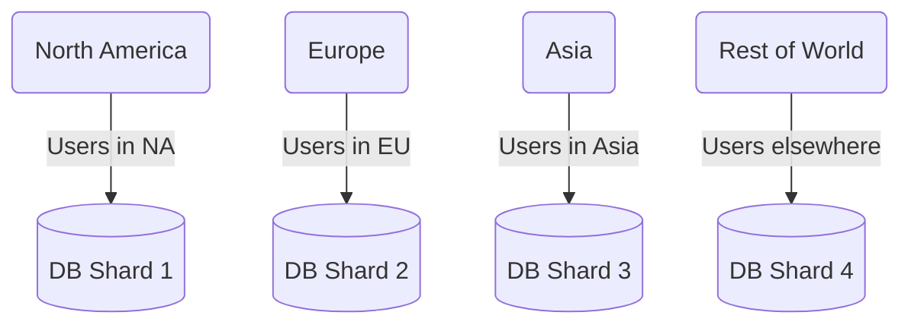
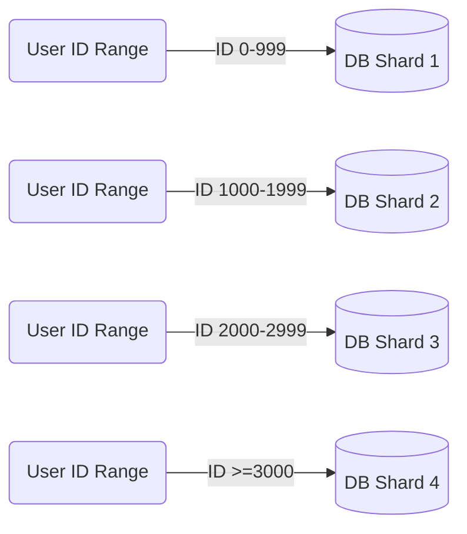
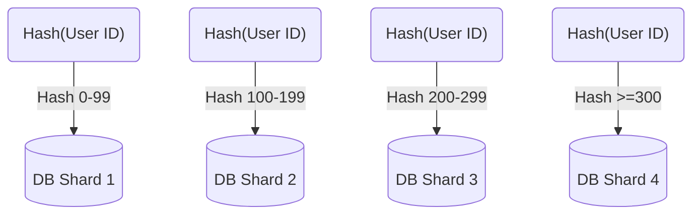

> TL;DR - Database sharding can significantly improve both read and write performance under the right circumstances unlike replication which only improve the read performance.

In traditional database systems, Relational Database Management Systems(RDBMS) can hit performance limits due to CPU, memory, or disk bottlenecks, requiring premium hardware for maintaining performance. Yet, even the best hardware may not meet the data demands of successful modern applications. 

To manage large data sets, tables can be split into horizontal segments, known as *shards*, and distributed across different database servers. Each server is only responsible for a subset of the data (**data shard**) it stores. Any data request will first need to go through a hashing process, so that it can be redirected to the server which contains the corresponding data shard. This technique, termed **database sharding**, strategically partitions tables.

Sharding is best suited to NoSQL databases. Whilst it can be applied to relational databases, it is much more difficult to implement as they need to adhere to strict Consistency and Atomicity rules. As it is harder to perform cross-shard queries and joins, sharding might limit the types of queries that can be performed.

## Sharding Strategies

Selecting the right sharding strategy depends on data structure. The most common methods include:

### Geo-Based Sharding

Data is allocated based on geographical location, e.g., the continent or region like "East US". Nodes closest to the user reduce latency, but the geographic distribution of users might be uneven.

### Range-Based Sharding

Data is divided according to key value ranges, such as the first letter of a name, which results in simple partition calculations but potentially uneven data distribution.

### Hash-Based Sharding

A hashing function distributes data evenly across partitions, reducing hotspots, yet related rows might be split, preventing performance optimization.

### Manual vs. Automatic Sharding
Some databases automatically manage sharding, dynamically adjusting partitions for balanced data and query distribution—enhancing performance. However, not all databases offer automatic sharding. Manual sharding at the application layer can be quite complex and may cause hotspots.

- **Increased Development Complexity:** Sharding introduces substantial development complexity, necessitating that applications select an optimal sharding strategy and determine shard quantity based on data growth projections. Should these projections change, the application must tackle data re-balancing, and at runtime, ascertain the specific shard housing the required data and the method to access it.
- **Data Distribution Imbalances:** Manual sharding may lead to uneven data distribution across shards, departing from initial estimations. Such disparities can result in 'hotspots,' causing performance bottlenecks and potential server crashes.
- **Scalability and Re-partitioning Issues:** Selecting a shard count that's too low initially can force a re-partitioning exercise to rectify performance degradation due to data volume increase. This process is intricate and particularly challenging when it's imperative to avoid system downtime.
- **Complex Schema Changes:** With sharding, even routine operational tasks, like database schema updates, grow in complexity. Ensuring schema consistency across shards and accurately migrating data to a new schema—in the case of non-backward compatible changes—complicates maintenance tasks.

## Benefits of Sharding
1. Scalability with growing data.
2. Faster query performance due to smaller indexed datasets.
3. Reduced system-wide downtime, with each shard isolated.
4. Use of less expensive commodity hardware.

## Drawbacks of Sharding
1. Sharding isn’t natively supported by every database engine 
    - For instance, PostgreSQL does not include automatic sharding as a feature, although it is possible to manually shard a PostgreSQL database. There are a number of Postgres forks that do include automatic sharding, but these often trail behind the latest PostgreSQL release and lack certain other features. Some specialized database technologies — like MySQL Cluster or certain database-as-a-service products like MongoDB Atlas — do include auto-sharding as a feature, but vanilla versions of these database management systems do not. Because of this, sharding often requires a “roll your own” approach. This means that documentation for sharding or tips for troubleshooting problems are often difficult to find.
2. Maintaining foreign key relationships across shards is challenging.
3. Complexities and hotspots in manual sharding.
4. Limitations on types of cross-shard queries, like joins.
5. Difficulty in changing or reverting the sharding setup.
6. Increased operational costs due to shards requiring high-availability solutions.

## Should I Shard?

> This part is copy from the original article from [Understanding Database Sharding](https://www.digitalocean.com/community/tutorials/understanding-database-sharding#should-i-shard)

Whether or not one should implement a sharded database architecture is almost always a matter of debate. Some see sharding as an inevitable outcome for databases that reach a certain size, while others see it as a headache that should be avoided unless it's absolutely necessary, due to the operational complexity that sharding adds.

Because of this added complexity, sharding is usually only performed when dealing with very large amounts of data. Here are some common scenarios where it may be beneficial to shard a database:

- The amount of application data grows to exceed the storage capacity of a single database node.
- The volume of writes or reads to the database surpasses what a single node or its read replicas can handle, resulting in slowed response times or timeouts.
- The network bandwidth required by the application outpaces the bandwidth available to a single database node and any read replicas, resulting in slowed response times or timeouts.

Before sharding, you should exhaust all other options for optimizing your database. Some optimizations you might want to consider include:

- Setting up a remote database. If you're working with a monolithic application in which all of its components reside on the same server, you can improve your database's performance by moving it over to its own machine. This doesn't add as much complexity as sharding since the database's tables remain intact. However, it still allows you to vertically scale your database apart from the rest of your infrastructure.
- Implementing [caching](https://en.wikipedia.org/wiki/Database_caching). If your application's read performance is what's causing you trouble, caching is one strategy that can help to improve it. Caching involves temporarily storing data that has already been requested in memory, allowing you to access it much more quickly later on.
- Creating one or more read replicas. Another strategy that can help to improve read performance, this involves copying the data from one database server (the *primary server*) over to one or more *secondary servers*. Following this, every new write goes to the primary before being copied over to the secondaries, while reads are made exclusively to the secondary servers. Distributing reads and writes like this keeps any one machine from taking on too much of the load, helping to prevent slowdowns and crashes. Note that creating read replicas involves more computing resources and thus costs more money, which could be a significant constraint for some.
- Upgrading to a larger server. In most cases, scaling up one's database server to a machine with more resources requires less effort than sharding. As with creating read replicas, an upgraded server with more resources will likely cost more money. Accordingly, you should only go through with resizing if it truly ends up being your best option.

Bear in mind that if your application or website grows past a certain point, none of these strategies will be enough to improve performance on their own. In such cases, sharding may indeed be the best option for you.