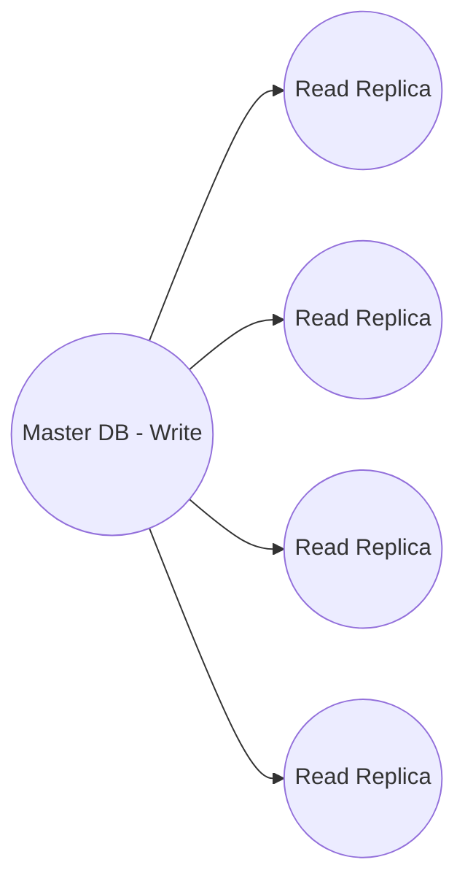

When faced with a system design interview, a critical decision is the choice of database technology: SQL or NoSQL. Each type has distinct advantages (+) and disadvantages (-) that must be weighed against the specific requirements of the use case.

## SQL Databases

- **Advantages:**
    - **Inter-Table Relationships:** Known as relational databases, SQL makes it easy to perform queries across multiple tables linked through primary and foreign keys, thus providing a robust structure for managing complex datasets.
    - **Data Structuring:** With SQL schemas, data organization is standardized through defined columns and tables, minimizing the chance of errors by setting clear expectations for data format.
    - **ACID Compliance:** SQL databases adhere to ACID principles, offering reliable transaction support, resulting in operations that are fully executed or rolled back if any part fails, as illustrated below:
        ```sql
        BEGIN TRANSACTION transfer_money_1922;
        UPDATE balances SET balance = balance - 25 WHERE account_id = 10;
        UPDATE balances SET balance = balance + 25 WHERE account_id = 155;
        COMMIT TRANSACTION;
        ```
        `An instance of transferring $25 between two account balances.`
- **Disadvantages:**
    - **Structured Rigidity:** Predefined columns and tables necessitate more setup time and hinder the handling of unstructured data.
    - **Scaling Challenges:** Horizontal scaling is cumbersome for SQL databases due to their relational framework, particularly for write-intensive applications. Ultimately, expensive vertical scaling may be the only option.

:::infoCan only apply horizontally scaling to Read, but not write

1. Additional **read replicas** improve availability at the expense of eventual consistency, aligning with the [CAP theorem](/software-development/system-design/data/cap-theorem/)'s trade-offs.
2. Horizontally scaling write-oriented SQL databases *is not infeasible*—Google Spanner and CockroachDB are testament to that—but it introduces complexity in database architecture.
:::


## NoSQL Databases

- **Advantages:**
    - **Flexibility with Unstructured Data:** NoSQL is adept at handling data without predefined relationships, often stored as documents or key-value pairs, which streamlines the setup process.
    - **Ease of Horizontal Scaling:** NoSQL facilitates distribution across data stores (sharding), enhancing scalability and supporting both read-heavy and write-heavy applications through techniques like hashing and consistent hashing.
    ```mermaid
    graph LR
        QR(Query Router) -.-> DB1((Shard 1))
        QR -.-> DB2((Shard 2))
        QR --> DB3((Shard 3))
        QR -.-> DBn((Shard 4))
    ```
- **Disadvantages:**
    - **Eventual Consistency:** Peer-to-peer replication in NoSQL, especially in write-heavy contexts, may imply delays in data synchronization across replicas, leading to temporary inconsistencies. **Eventual consistency** isn’t exactly a fault of NoSQL databases, but distributed databases in general. A single shard NoSQL database can be strongly consistent, but to fully take advantage of the scalability benefits of NoSQL, the database should be set up as a distributed cluster.

## Conclusion
 
While SQL databases excel in structured data and established relationships with ACID compliance, NoSQL databases offer superior flexibility, scale, and simplicity for unstructured data scenarios. Selecting the appropriate database hinges on the specific needs of the system, factoring in data structure, scalability requirements, and consistency preferences.