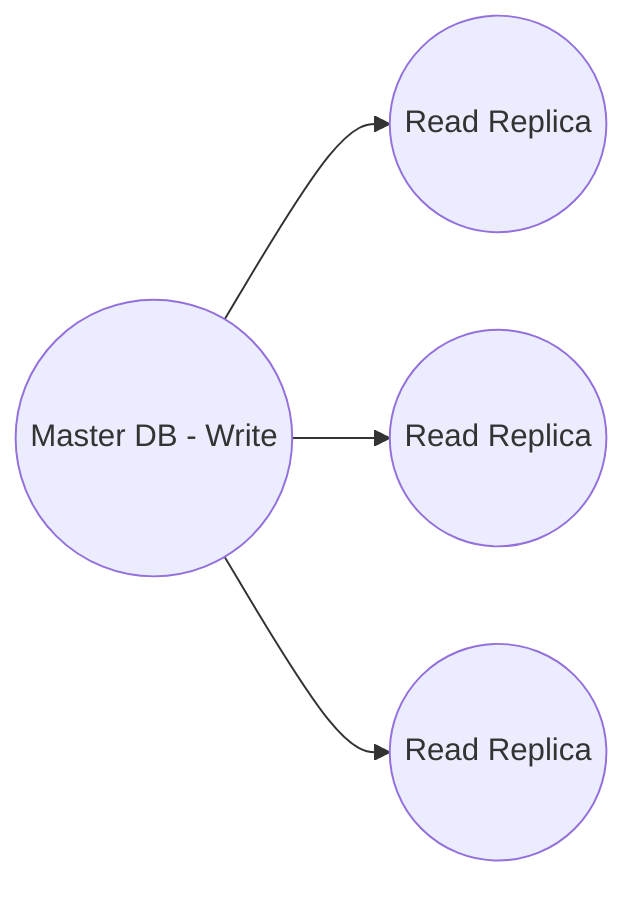

When we design a system, a critical decision is the choice of database technology: SQL or NoSQL. Each type has distinct advantages and disadvantages that must be weighed against the specific requirements of the use case. A key consideration in this decision is the nature of the data you need to store and manage. Structured data and unstructured data play a crucial role in determining the appropriate database technology. Structured data is highly organized, typically stored in tabular formats with well-defined relationships, making it ideal for SQL databases. On the other hand, unstructured data lacks a predefined schema, encompassing diverse formats like text, images, and videos, which are better suited for NoSQL databases.

## Structured and unstructured data

Understanding the fundamental differences between structured and unstructured data helps in making an informed choice between SQL and NoSQL databases. 

**Structured data** is data that is highly organized and formatted in a way that makes it easily searchable and analyzable by databases and other systems. It adheres to a predefined schema, typically arranged in tables with rows and columns, where each column represents a specific attribute or field, and each row represents a record or entry.

**Unstructured data** refers to information that does not have a pre-defined data model or schema. This includes a variety of formats such as text, images, audio, and video, which do not fit neatly into relational databases. Despite this, many NoSQL databases and other storage systems can indeed store and manage unstructured data. 
Unstructured data refers to information that does not have a pre-defined data model or schema.

:::warning If we can store unstructured data in SQL databases, why we need to use NoSQL?
You can store unstructured data, such as text data, web content, or social media data, in SQL databases. However, these types of data are still considered unstructured because they do not fit neatly into the rigid schema of a traditional relational database, which is designed for highly organized, tabular data with well-defined relationships.

SQL databases excel at handling tabular data with well-defined relationships and constraints. When dealing with unstructured data, several challenges arise:
- **Schema Rigidity**: Traditional SQL databases require a predefined schema. While modern SQL databases offer some flexibility with JSON fields, they still operate within a structured framework.
- **Complex Queries**: Performing complex queries on unstructured data stored in SQL databases can be cumbersome and less efficient compared to NoSQL databases designed for such purposes.

While SQL databases can technically handle unstructured data, NoSQL databases are specifically designed to manage, store, and retrieve unstructured data more efficiently. They offer greater flexibility, scalability, and performance for handling diverse data types without requiring a predefined schema.
:::

### Characteristics

- **Structured Data**
    - **Schema-Based**: Follows a predefined schema or model with tables, columns, and data types.
    - **Tabular Format**: Organized into rows and columns.
    - **Searchability**: Easily searchable using SQL queries.
    - **Data Integrity**: High due to enforced rules and constraints.
    - **Consistency**: Well-defined relationships between data entities.
    - **Indexing**: Supports indexing for fast data retrieval.
    - **Validation**: Data can be validated against the schema.
    **Examples**: Customer databases, financial records, inventory systems.
- **UnStructured Data**
    - **Lack of Schema**: No predefined structure or schema.
    - **Diverse Formats**: Includes text, images, videos, audio, social media posts, and web content.
    - **Storage Complexity**: Requires specialized storage solutions like NoSQL databases and data lakes.
    - **Search and Analysis**: Complex to search and analyze; often requires advanced tools and techniques.
    - **Scalability**: Typically stored in systems designed for horizontal scaling.
    - **Metadata**: Relies on metadata for context and improved searchability.
    **Examples**: Emails, multimedia files, social media content, web content.

### 4 types of Unstructured Data

NoSQL databases are designed to handle unstructured data effectively by providing flexible data models and storage mechanisms. Here’s how they manage different types of unstructured data:

- **Document Stores**
    - **Characteristics**: Store data as documents (e.g., JSON, BSON, XML) with a flexible schema.
    - **Examples**: MongoDB, CouchDB
    - **Unstructured Data**: JSON documents, web content, emails
    - **Usage Scenario**: Managing blog posts, comments, and metadata.
- **Key-Value Stores**
    - **Characteristics**: Store data as key-value pairs, ideal for simple lookups.
    - **Examples**: Redis, DynamoDB
    - **Unstructured Data**: Session data, user profiles, caching information
    - **Usage Scenario**: Storing user session information for quick retrieval.
- **Wide-Column Stores**
    - **Characteristics**: Store data in tables, rows, and dynamic columns.
    - **Examples**: Apache Cassandra, HBase
    - **Unstructured Data**: Sensor data, logs, time-series data
    - **Usage Scenario**: Managing large volumes of time-series data from IoT devices.
- **Graph Databases**
    - **Characteristics**: Store data in nodes, edges, and properties.
    - **Examples**: Neo4j, Amazon Neptune
    - **Unstructured Data**: Social network data, recommendation engines
    - **Usage Scenario**: Storing and querying data for social networks to understand user relationships.

### Examples of Unstructured Data

#### Text Documents (Emails, Word Documents, PDFs)

**Storage Solution**: MongoDB (Document Store)

**Example Document**:
```json
{
  "_id": "unique_email_id",
  "subject": "Project Update",
  "body": "Here is the update on the project status...",
  "attachments": [
    {
      "file_name": "report.pdf",
      "file_type": "application/pdf",
      "data": "<base64_encoded_data>"
    }
  ],
  "sender": "john.doe@example.com",
  "recipients": ["jane.smith@example.com"],
  "sent_date": "2024-06-25T09:00:00Z"
}
```
Emails and documents are stored as JSON objects with fields for subject, body, attachments, sender, recipients, and sent date.

#### Multimedia Files (Images, Videos, Audio Files)

**Storage Solution**: Amazon S3 (Object Storage)

**Example Metadata Document**:
```json
{
  "image_id": "unique_image_id",
  "file_name": "photo.jpg",
  "upload_date": "2024-06-25T12:00:00Z",
  "metadata": {
    "size": "2MB",
    "resolution": "1920x1080"
  },
  "s3_url": "https://s3.amazonaws.com/bucket_name/photo.jpg"
}
```
Images are stored in S3 with metadata managed in a NoSQL database like DynamoDB, including information like file name, upload date, size, resolution, and URL.

#### Social Media Content (Tweets, Facebook Posts, Comments)

**Storage Solution**: Elasticsearch (Search and Analytics Engine)

**Example Document**:
```json
{
  "post_id": "unique_post_id",
  "user_id": "user_123",
  "content": "This is a sample tweet.",
  "timestamp": "2024-06-25T12:00:00Z",
  "likes": 100,
  "retweets": 20,
  "comments": [
    {
      "user_id": "user_456",
      "comment": "Great post!",
      "timestamp": "2024-06-25T12:30:00Z"
    }
  ]
}
```
Social media posts are stored as JSON documents with fields for post ID, user ID, content, timestamp, likes, retweets, and comments.

#### Web Content (HTML Pages, Blog Posts, Forum Discussions)

**Storage Solution**: CouchDB (Document Store)

**Example Document**:
```json
{
  "_id": "unique_page_id",
  "url": "https://example.com/page",
  "title": "Sample Web Page",
  "content": "<html><body>Welcome to our website!</body></html>",
  "last_updated": "2024-06-25T12:00:00Z"
}
```
Web content is stored as documents with fields for URL, title, HTML content, and last updated timestamp.

## SQL Databases

- **Advantages:**
    - **Inter-Table Relationships:** Known as relational databases, SQL makes it easy to perform queries across multiple tables linked through primary and foreign keys, thus providing a robust structure for managing complex datasets.
    - **Data Structuring:** With SQL schemas, data organization is standardized through defined columns and tables, minimizing the chance of errors by setting clear expectations for data format.
    - **ACID Compliance:** SQL databases adhere to ACID principles, offering reliable transaction support, resulting in operations that are fully executed or rolled back if any part fails, as illustrated below:
        ```sql
        BEGIN TRANSACTION transfer_money_1922;
        UPDATE balances SET balance = balance - 25 WHERE account_id = 10;
        UPDATE balances SET balance = balance + 25 WHERE account_id = 155;
        COMMIT TRANSACTION;
        ```
        `An instance of transferring $25 between two account balances.`
- **Disadvantages:**
    - **Structured Rigidity:** Predefined columns and tables necessitate more setup time and hinder the handling of unstructured data.
    - **Scaling Challenges:** Horizontal scaling is cumbersome for SQL databases due to their relational framework, particularly for write-intensive applications. Ultimately, expensive vertical scaling may be the only option.

:::info What is ACID?
> TL-DR: If one of a SQL statement in a db transaction fails, the whole db transaction will be forbidden

- **Atomicity** requires that either transaction as a whole be successfully executed or if a part of the transaction fails, then the entire transaction be invalidated. 
- **Consistency** mandates the data written to the database as part of the transaction must adhere to all defined rules, and restrictions including constraints, cascades, and triggers. 
- **Isolation** is critical to achieving concurrency control and makes sure each transaction is independent unto itself.
- **Durability** requires that all of the changes made to the database be permanent once a transaction is successfully completed.
:::

:::warning Is relational database same as SQL database?
Yes. An SQL database—also known as a relational database—is named for the programming language it's written in, Structured Query Language (SQL). It's the more rigid, structured way of storing data.
:::

:::warning Aren't SQL and the relational model synonymous?
No. The relational model is a set of mathematical concepts applied to data of different shapes. It is the most general form of database mathematics and provides a mathematical foundation to effectively support any operation within a given domain. On the other hand, SQL is a database language that supports an important subset of relational capabilities.
:::

:::warning SQL can only apply horizontally scaling to Read, but not write

```mermaid
graph LR
  MasterDB((Master DB - Write)) --> Replica1((Read Replica))
  MasterDB --> Replica2((Read Replica))
  MasterDB --> Replica3((Read Replica))
```
- Additional **read replicas** improve availability at the expense of eventual consistency, aligning with the [CAP theorem](/software-development/system-design/data/cap-theorem/)'s trade-offs.
- Horizontally scaling write-oriented SQL databases *is not infeasible* — [Google Spanner](https://cloud.google.com/spanner) and [CockroachDB](https://www.cockroachlabs.com/) are testament to that—but it introduces complexity in database architecture.
:::


## NoSQL Databases

- **Advantages:**
    - **Flexibility with Unstructured Data:** NoSQL is adept at handling data without predefined relationships, often stored as documents or key-value pairs, which streamlines the setup process.
    - **Ease of Horizontal Scaling:** NoSQL facilitates distribution across data stores (sharding), enhancing scalability and supporting both read-heavy and write-heavy applications through techniques like hashing and consistent hashing.
    ```mermaid
    graph LR
        QR(Query Router) -.-> DB1((Shard 1))
        QR -.-> DB2((Shard 2))
        QR --> DB3((Shard 3))
    ```
- **Disadvantages:**
    - **Eventual Consistency:** Peer-to-peer replication in NoSQL, especially in write-heavy contexts, may imply delays in data synchronization across replicas, leading to temporary inconsistencies. **Eventual consistency** isn’t exactly a fault of NoSQL databases, but distributed databases in general. A single shard NoSQL database can be strongly consistent, but to fully take advantage of the scalability benefits of NoSQL, the database should be set up as a distributed cluster.

## Conclusion
 
While SQL databases excel in structured data and established relationships with ACID compliance, NoSQL databases offer superior flexibility, scale, and simplicity for unstructured data scenarios. Selecting the appropriate database hinges on the specific needs of the system, factoring in data structure, scalability requirements, and consistency preferences.