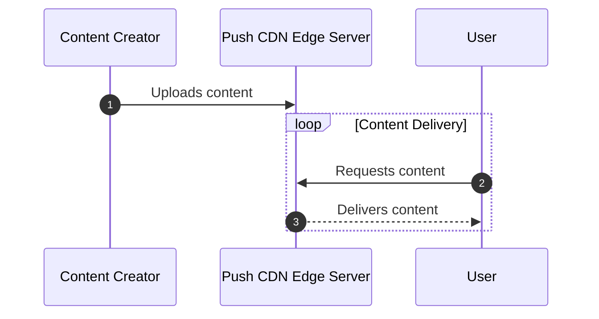
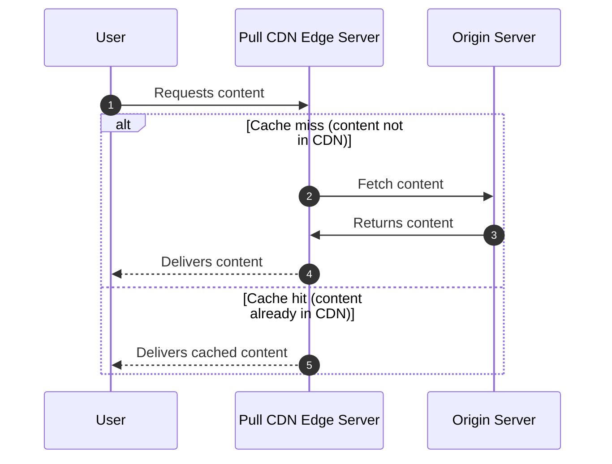

## Web protocols

Web protocols might not be an area you're likely to deep-dive or discuss explicitly in your interview, but having a thorough understanding of the architecture underpinning the internet will be extremely helpful in designing anything built to transmit data over the web. If you are asked specific follow-ups, remember:

- At the transport layer, you're likely to choose either the TCP or UDP protocol to send data. Choose TCP if you're more concerned with data accuracy, and UDP if quick transmission is needed (with tolerance for some errors - like in a video streaming application.)
- At the application layer, you have some choices to make as well. You'll probably choose HTTPS over HTTP for security reasons. If you need to maintain open client-server communications (for example, if you're building a fast-paced two-player game and you need to maintain up-to-date scores) you may choose WebSocket over HTTP.
- If you're designing a service with an API, consider HTTP (HTTPS) over WebSocket as you'll be able to make use of HTTPs standardized request methods and status codes; important if you're designing a RESTful API.

## Load Balancing

Below are 3 points to keep in mind when implement load balancing to your application
- Bottlenecks. As scale increases, load balancers can themselves become a bottleneck or single point of failure, so multiple load balancers must be used to guarantee availability. [DNS round robin](https://en.wikipedia.org/wiki/Round-robin_DNS) can be used to balance traffic across different load balancers.
- User sessions. The same user's requests can be served from different backends unless the load balancer is configured otherwise. This could be problematic for applications that rely on session data that isn't shared across servers.
- Longer deploys. Deploying new server versions can take longer and require more machines since the load balancer needs to roll over traffic to the new servers and drain requests from the old machines.

## CDN

A CDN can be thought of as a globally distributed group of servers that cache static assets for your origin server. Every CDN server has its own local cache and they should all be in sync. There are two primary ways for a CDN cache to be populated, which creates the distinction between Push and Pull CDNs. 

- In a Push CDN, it’s the responsibility of the engineers to push new/updated files to the CDN, which would then propagate them to all of the CDN server caches. 
- In a Pull CDN, the server cache is lazily updated: when a user sends a static asset request to the CDN server and it doesn’t have it, it’ll fetch the asset from the origin server, populate its cache with the asset, and then send the asset to the user.

### Push CDN 

In a Push CDN, it’s the responsibility of the engineers to push new/updated files to the CDN, which would then propagate them to all of the CDN server caches. 

### Pull CDN 

In a Pull CDN, the server cache is lazily updated: when a user sends a static asset request to the CDN server and it doesn’t have it, it’ll fetch the asset from the origin server, populate its cache with the asset, and then send the asset to the user.

### The Differences and Maintenance Implications

Content Delivery Networks (CDNs) are crucial in delivering assets quickly to end-users worldwide. However, the choice between Push and Pull CDNs can significantly impact the maintenance workload for developers.

#### Push CDNs: Proactive Maintenance Required

With a **Push CDN**, developers have an additional task whenever an asset is updated or created. They must actively push these changes to the CDN. If this step is omitted, the client will not access the updated content—resulting in the need for continuous management to ensure the CDN reflects the most current assets.

#### Pull CDNs: Easier Maintenance with Some Caveats

**Pull CDNs**, on the other hand, offer a less maintenance-intensive alternative. These CDNs automatically retrieve (or "pull") assets from the origin server that are not already in its cache. While this reduces engineering efforts, it introduces a temporary drawback: the CDN's cached assets may become outdated if they have been updated on the origin server, leading to a condition known as "cache staleness."

The first request for an asset from a Pull CDN can also be slow because it necessitates fetching the content from the origin server.

#### Popularity and Cache Staleness Mitigation

Despite these downsides, Pull CDNs are widely favored for their simpler maintenance. Several strategies help to mitigate the stale cache issue:

- **Timestamps and Expiration**: Pull CDNs often attach a timestamp to cached assets, frequently setting a default cache duration of up to 24 hours. After this period, if an asset is requested that has expired in the cache, the CDN will re-fetch the updated version from the origin server.
- **Cache-Control Headers**: These headers provide flexibility in cache policies, enabling configurations for assets to be re-fetched at more frequent intervals, such as every five minutes or upon new release versions.
- **Cache Busting**: By caching assets with a unique identifier like a hash or etag that changes with each update, stale assets are less likely to be served to the end-user.

### When not to use CDNs?

There are some situations where you do not want to use CDNs. If your service’s target users are in a specific region, then there won’t be any benefit of using a CDN, as you can just host your origin servers there instead. CDNs are also not a good idea if the assets being served are dynamic and sensitive. You don’t want to serve stale data for sensitive situations, such as when working with financial/government services.

----

