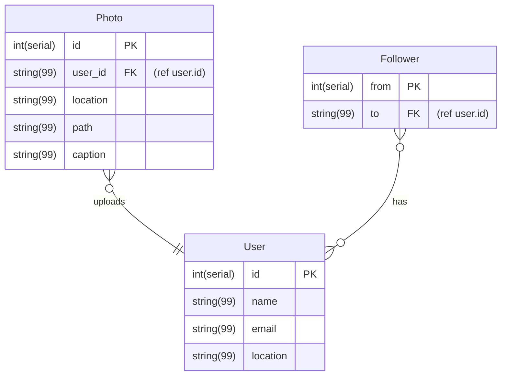

It takes years for a team of engineers to build a system that you've been asked to design within a 45-minute interview. Using a framework is an effective way to structure your response and ensure you're addressing all the key aspects an interviewer is looking for.

This lesson covers an interview framework that helps you:

- Design a complicated system under tight time pressure
- Allocate your time wisely by focusing on the essential aspects of the design
- Clearly communicate with the interviewer
- Lead the discussion toward a productive outcome

By using this framework, you'll stand out as an experienced candidate who not only envisions the design at a high level, but also dives deep to address realistic constraints and various operational scenarios.

### The 5-step framework

A system design interview answer typically consists of 5 steps:

1. Define the problem. (8 minutes)
    - Ask clarifying questions to gather more information about the system requirements. Then, estimate the amount of data. 
2. Design the system at a high level.  (10 minutes)
    - Explain how each part of the system works together. Design the APIs and data model. Then, create a high-level design diagram.
3. Deep-dive into the design. (10 minutes)
    - Examine the system components and their relationships in detail. Assess tradeoffs and evaluate design choices. 
4. Identify bottlenecks and scaling opportunities. (10 minutes)
    - Zoom out and consider if the system can scale. Incorporate the non-functional requirements through optimization techniques. 
5. Review and summarize. (4 minutes)
    - Summarize requirements, justify decisions, suggest alternatives, discuss additional tradeoffs, and answer any questions. 

:::infoNote
While it's important to integrate all the steps into a structured interview framework, you can adjust the time allotted for each step based on your interview style and the problem you're trying to solve.
:::

We'll use the example, "How would you design Instagram?" throughout the framework to demonstrate how you can apply the framework steps in a real-world system design interview.

## 1. Define the problem

It's common for system design interview questions to be vague. Asking clarifying questions is a critical first step, as it creates the foundation that your system will be built upon.

Your main objective in this first step is to narrow down what key features and/or aspects of the system your interviewer is most interested in. Consider assigning priorities, such as P0, P1, etc., to each requirement in order to prioritize your time. By doing so, you demonstrate to the interviewer that you can translate an ambiguous problem into tangible requirements that impact your design approach.

Some sample questions you might ask your interviewer include:

- What specific features are we going to build?
- How many users does the product have?
- Are we creating the system from scratch? Do we need to talk to pieces of the existing system?
- Who are our clients/consumers?

:::info"How would you design Instagram?" example
To start, I'd like to ask some clarifying questions about the key features and aspects we need to include in the design:

1.  What is the scale of the product we are building (number of users)?
2.  How should user feeds be generated? Should they be ordered in any way?
3.  What kind of data are we expected to support (text, images, video)?
4.  Should we support updating/editing of posts?
:::

### Define Functional requirements

Identify and discuss the functional requirements of the system, using the insights gained from your clarifying questions. Establishing the system's core functionality will help you determine what is in and out of scope for the specific interview.

:::info"How would you design Instagram?" example
Based on the insights gathered from my clarifying questions, I can boil down the primary areas and features of Instagram to the following:

Instagram primarily:
- Allows its wide user base to view and contribute posts on the feed
- Customizes each feed, based on the user's following

Given its primary features, Instagram's functional requirements include:
- Users can upload images from a mobile client to create a post
- Users can follow other users
- Users can view a feed of images
:::

### Define Non-functional requirements

Once you've aligned with your interviewer on the functional requirements, think about the non-functional requirements of the system design. These might be linked to business objectives or the user experience.

Below is the table of some of the non-functional requirements. Check [System design principle](/software-development/system-design/models-patterns-strategy/system-design-principle/) for what AWS define their Well-Architected 6 piallars are.

| Requirement | Question |
| --- | --- |
| Performance | How fast is the system? |
| Scalability | How will the system respond to increased demand? |
| Reliability | What is the system's uptime? |
| Resilience | How will the system recover if it fails? |
| Security | How are the system and data protected? |
| Usability | How do users interact with the system? |
| Maintainability | How will you troubleshoot the system? |
| Modifiability | Can users customize features? Can developers change the code? |
| Localization | Will the system handle currencies, timezone, languages? |

Based on the non-functional requirement, here are the some questions you might ask your interviewer:
- What scale is this system?
- How many users should our app support?
- How many requests should our system handle?
- Are most use cases read-only?
- How important is it that users see accurate, up-to-date data? How important is it that services are available? How important is it for us to horizontally scale?

Depending on the design constraints that your interviewer responds with, focus on the most critical aspects. Make sure to explain your reasoning to your interviewer and check in with them. They may be interested in a particular aspect of your system, so listen to **their hints** if they nudge you in one direction.

:::info"How would you design Instagram?" example
Given our functional requirements, it is safe to assume that our non-functional requirements include:
- High availability
- Scalability
- Low latency

Since it's not a high priority for users to see the most up-to-date data, I will assume it's okay for the user to see eventually consistent data. In this case, I'll choose availability and fault tolerance over consistency.
:::

### Estimate the amount of data

Once you've defined your requirements, you'll likely need to do some quick calculations to estimate the amount of data you're dealing with. These estimates should help you choose components and give you an idea of what scaling might look like later.

Interviewers generally want to see you make two key calculations:

-   Storage: Determine how much data the system will generate, to help inform later decisions around storage solutions.
-   Throughput: Determine the number of requests per second (RPS), which you can split into the read and write RPS. Sometimes you may also need to come up with the bandwidth requirements of the system.

To make these estimations, you'll need to make some assumptions about user volume and typical user behavior. Since these estimates won't be exact, check with your interviewer to see if these assumptions match their expectations.

:::cautionNote
It's possible your interview will have a system design problem that doesn't exactly fit this mold of servers. For example, your interviewer may ask you to "design a web crawler." In this scenario, pick a different way to measure throughput and storage, such as the number of web pages and frequency of jobs.
:::

:::info"How would you design Instagram?" example
To start, I'll estimate the amount of storage needed to hold a year's worth of user data.
- 10M Monthly Active Users
- 2 Photos uploaded per month
- 5MB per photo

Result: 10^7 \* 2 \* 5MB = 10^8MB = 100TB per month = 1.2PB per year

Next, I'll compute estimates for the system's QPS(Queries per second) number.

- 10M Monthly Active Users
- ~3M Daily Active Users
- One minute has 60 seconds, One hour has 60 minutes, and one day has 24 hours. Thus, 80 x 60 x 24 = 86,400 seconds in a day.

Write QPS: ~600k photo uploads = 6\*10^5/86400 = ~10(6.944..) uploads per sec
Read QPS: 10 reads per day * 3M DAU / 86400 = ~350(347.222..) reads per sec
:::


## 2. Design the system at a high level

Based on the requirements outlined above, design a high-level system and briefly explain how each piece of the system will work together.

The main objective in this step is to incorporate the requirements you identified in the previous step into your system's main components. Your interviewer is assessing whether you can visualize and communicate the system's overall data structure. *Don't get into the details too soon, or you might run out of time or design something that doesn't work with the rest of the system*.

### Design your APIs

Introduce your system by designing your APIs(Application Programming Interfaces). These APIs will become the foundation of your system's architecture, so they should not be easily changed once you've established them.

Each requirement should translate to one or more APIs. You can choose what type of APIs you want to use. Common API types include:

- Representational State Transfer [REST],
- Simple Object Access Protocol [SOAP],
- Remote Procedure Call [RPC], and
- GraphQL

When choosing your APIs, consider the request's parameters and the response type. Clarify which APIs you've chosen with your interviewer, and explain why.

:::cautionNote
If you notice that the APIs don't fit the solution well as the interview progresses, it's okay to iterate on them.
:::

:::info"How would you design Instagram?" example
Because our system does not require the server to independently send or push data to the client, we can use standard REST APIs to facilitate communications between the client and the server.

Below we can mock some of our REST APIs mapped from our functional requirements.

```
POST /createPost
{
    UserID
    Caption
    UrlPath
}
POST /follow
{
    FormUserID
    ToUserID
}
Get /getFeed/{UserID}
```
:::

### Design your data model

Once you've designed your APIs, move onto designing your data model. The primary issue to address here is: "What data do we need to store in our database and how do we store it?"

When designing an effective data model, you need to determine:

1.  The type of the data that the system wants to collect/capture (for example, metadata, video files, blob storage, text, video storage)
2.  The attributes of the data (for example, does it belong to a specific user? Is the time of submission relevant?)
3.  How you'll store the data, considering the functional requirements
4.  How the data will interact with each other, with users/clients, and with the APIs
5.  Whether to use a SQL or NoSQL database


:::info"How would you design Instagram?" example
The system wants to collect/capture 3 different data types:

- User data - Metadata relevant to the users of the application
- Photos - Data related to a user uploaded post/photo
- User Followers - Stores the relationships between User-to-User

Specific attributes of the data include:

- Photo entries can trace to a specific user
- User followers have a 1:1 mapping
- Photos table will only store metadata and content is referenceable via URL path

Considering the functional requirements, which prioritize relational querying between photos, users, and followers, I'll store the data by maintaining a separate table for each data type with foreign key references between them.

Back-end services will perform a JOIN operation on the followers and photo tables in order to generate a feed for each unique user request.

The Instagram product relies heavily on the relation between these data types to support fetching user feeds. A common query would be to fetch all photos for a group of (followed) users. Because of this, it would make sense to use a SQL Database to host our data models.


:::

### Create a high-level design diagram

After designing the APIs and data model, the next step is to create a high-level design diagram. The diagram should act as a blueprint of our design and highlight the most critical pieces to fulfill the functional requirements.

At this step, your interviewer wants to see that you have a broad understanding of how the overall system will function. Instead of diving into the details of each service, *communicate whether the design satisfies all the functional requirements*. Demonstrate to the interviewer **how the data and control flow look in each functional requirement**.

:::cautionCaution
However, if the interviewer explicitly asks us to design one of the functionalities, omit the rest in the diagram and only focus on the service of interest.
:::

:::info"How would you design Instagram?" example
First, we can mock out the core functionality of our system to incorporate all of our functional requirements.

The system below incorporates the following workflows:

1.  Users can upload images from a mobile client to create a post: Users will issue a request to the write App Server which will write post metadata and the photo to the databases.
2.  Users can following other users: similar to above, the write app server will process follow requests and write the relation to the Follows table in the database.
3.  Users can view a feed of images: In this work-stream the user issues a request to the Read App server which will query the Database for all posts belonging to the users they follow.


At this point all the functional requirements should be met. Moving forward, we can identify points of weakness in the current system and how we can address them alongside our non-functional requirements.
:::

## 3. Deep-dive into the design

Once you have a high-level diagram, it's time to examine system components and relationships in more detail. Walk your interviewer through the lifecycle of a user request to demonstrate that you understand how your system's various components work together.

The interviewer will likely want to ask questions about the system and how it works to support each functional requirement. Example questions include:

- Can you walk me through the steps on how a user feed is generated in this system?
- What other data storage options can we use to optimize performance?
- What benefit does splitting the write/read servers have on performance?

:::cautionRemember to checkin regularly
That being said, don't rely on them to drive the conversation. Check in regularly with your interviewer by asking questions such as:
:::

- Are there specific areas in the design that you have questions or concerns about?
- Would you like me to expand on this, or am I okay to move on?
- How does everything sound so far?

### Assess tradeoffs and evaluate your design choices

If the interviewer doesn't give you a clear directive, continue the conversation by explaining what tradeoffs you considered and how the system's requirements impacted your design choices.

Remember, there's no single "right" answer to a system design question. What matters more is your ability to logically communicate your ideas and make well-informed decisions. Weighing the tradeoffs between different choices to satisfy the system's requirements is considered one of the most critical skill sets in a system design interview.


:::info"How would you design Instagram?" example
Below we can outline some common trade-offs within the context of the problem.

**Relational vs. Non-Relational Database**

To fulfill the feed generation requirement, the system must perform a query on both the "follow" table and our "posts" table. This operation would greatly benefit from the JOIN operation, which is primarily supported by a SQL database.

However, two downsides of using SQL are that we must manually shard our database, and we lose flexibility of our data schema. If these downsides are acceptable for our example, we can still use SQL.

**Distribution vs. Query Performance**

Since SQL is not natively horizontally scalable, we will need to establish a sharding key so that our data will work at scale in a distributed system. Assuming the feed generation will want to prioritize recent posts from followers, a sharding key using both timestamp and user ID would provide the best advantage.

Other requests may be impacted/slowed, but SQL would provide the best performance for our highest priority request.

**Read/Write Service vs. Monolithic App Server**

I de-coupled the write vs. read capabilities into different services for the following reasons:

- They serve very different use cases that will leverage different technologies (e.g. Redis for read server and Kafka for write server)
- This technique minimizes noisy neighbor problems and supports fault tolerance. In the event that the write server has an outage, users can still read and vice versa.
- This technique encourages independent horizontal scaling, where read servers will most likely scale out more than writes. This comes at a tradeoff of additional software engineering complexity, instead of maintaining a monolithic service.
:::

## 4. Identify bottlenecks and scale

After completing a deep dive into the system components, it's time to zoom out and consider if the system can operate under various conditions and has room to support further growth. Your interviewer is assessing your ability to incorporate non-functional requirements through different optimization techniques.

Potential topics your interviewer might ask you about include:

- Is there a single point of failure? If so, how can we improve the robustness and enhance the system's availability?
- Is the data valuable enough to require replication? How important is it to keep all versions consistent if we replicate our data?
- Do we support a global service? If so, can we deploy multi-geo data centers to improve data locality?
- Are there any edge cases, such as peak time usage or hot users, that create a particular usage pattern that could deteriorate performance or even break the system?
- How do we scale the system to support 10 times more users? As we scale the system, we may want to upgrade each component or migrate to another architecture gradually.

:::info"How would you design Instagram?" example
A few examples of areas that can be improved include:

1.  Writes and reads in our system have high latency, especially when considering the scale we are working with.
    - We can optimize our reads by using **a Redis cache** and **CDN** to store data/photos that we will likely access in the future.
2.  Feed Generation may have a high computation time and lead to high latency of read requests
    - To optimize, we can instead maintain a cache or secondary table that is updated upon write. This is also known as the "Push" vs "Pull" model. In the push model, we maintain another database or table that is updated on write, so that we only have to read from one table.
3.  At scale, we may want to ensure high availability across our database and servers
    - To address this, we can add replicas across our system's app servers and database clusters.
    - For writes, we can add a message queue to asynchronously update the database to manage spikes in load. However, one caveat to be aware of is that a message queue may increase the system's latency.
4.  I would also consider the "celebrity" case where many users would need to get the same update at the same time.
    - To address this, I would asynchronously update user feeds in batches. Also, I would consider adding redundancy in our tables to spread out user traffic.


:::

## 5. Review and summarize

As you approach the end of the interview, take this opportunity to polish your response by calling out any topics you didn't get to address during the interview. By filling the potential gaps in your design, you're showing the interviewer that you have a comprehensive understanding of the system.

Other topics to include in your summary include:

- Reviewing requirements
- Justifying decisions
- Suggesting alternatives
- Discussing additional tradeoffs, and
- Answering questions.

:::info"How would you design Instagram?" example
The current state of our system works well as a distributed system and appropriately handles basic requests we scoped in our functional requirements. But, there are a few missing features we might want to support in the future:

1.  Comments: Secondly, if we wanted to support commenting in our system, I would consider adding a second table, as well as a service to handle comment requests and data.
2.  More customization: Lastly, from a product perspective, we can add more customization to user feeds by ranking them based on relevance. We could add a ranking service to our feed generation pipeline that can process other user properties (location, preferences, followers, etc.)

If given more time, I would check and see if our system would benefit from any other non-mentioned technologies in our design, such as:

1.  A reverse proxy may provide additional levels of security to our system.
2.  We may also want to identify which cache update policy would provide the best performance and experience to the end user.
3.  I also would go more into depth on the availability patterns and how our system would respond in cases of failure to a service or table to ensure there is no single point of failure.
4.  A potential concern is the two writes on the Consumer layer, one to Metadata DB and the other to Object Storage. If one of these writes fails, I would ensure that our consumer (and message queue) can retry these scenarios and ensure that writing to Object Storage is idempotent, meaning we deterministically generate the same path and do not re-upload the same file.
5.  If the Metadata DB has an outage, then we can rely on our cache to provide a somewhat operational service, as opposed to the service being completely unavailable.
:::


## Common pitfalls

- **Clarify the problem first, rather than jumping straight into the design**. 
    - If you skip this step, you'll risk making incorrect assumptions about the features that the interviewer wants you to build. These assumptions can easily take you on the wrong track, because you haven't checked which functional requirements are most important for your system. *The interviewer will likely flag that you aren't using your time efficiently*.
- **Budget time carefully by creating a high level design before diving into detail**. 
    - If you get into a rabbit hole of over-optimizing a specific design component, you may waste all your time focusing on something your interviewer doesn't care too much about. By presenting the foundations of your design at a high-level, you can engage in a two-way dialogue with your interviewer about which parts of your design are actually important.
- **Refer back to requirements periodically to ensure you're staying on track**.
    - It's easy to forget about your requirements as you move through the interview. Once forgotten, these requirements may get neglected in your design components. Reminding yourself and the interviewee of the critical requirements throughout the interview helps you stay on track with your design and helps the interviewer follow your logic.
- **Describe your decision tradeoffs in real-time to demonstrate your ability to evaluate pros and cons of different design solutions**. 
    - If you don't clearly state the tradeoffs you've considered, the interviewer may assume that you either don't know much about the other solution or didn't really consider it. 
    - They may even suspect that you're simply restating someone else's answer and you don't actually know how the different design approaches work. Don't let your interviewer make assumptions that aren't true! Explicitly communicate your tradeoff considerations.
- **Take hints from the interviewer about which topics to focus on**. 
    - Usually there's not enough time to optimize everything, so prioritize the areas that the interviewer expresses the most curiosity and interest in.

:::infoTip
"**The biggest misconception with system design interviews** is that you should focus on creating the 'optimal solution'. These interviews are meant to **assess a candidate's ability to analyze trade offs, make informed decisions, and communicate a solution effectively** to the interviewer. 

Oftentimes the question up front is intentionally broad and asking the right clarifying questions is needed to get critical information. **Questions are a strength** that show your ability to break down a complex problem into smaller components, asking 'I need X information so that I can decide whether Y or Z is best for our product use case."
:::