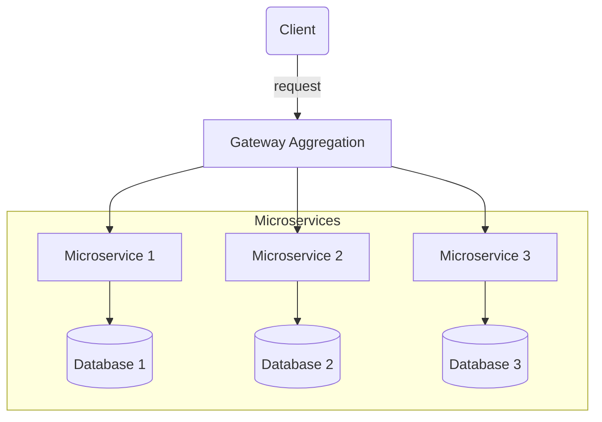

Availability, on the other hand, refers to the degree to which a system is operable and accessible when required for use. It not only involves the system’s ability to run without failure but also includes its ability to recover from failures that do occur. In reality, High availability (HA) is difficult to achieve for two reasons. 

- Scaling, or building a system to accommodate changes in traffic, is hard.
- Networks and hardware will fail.

**Key aspects**
- Availability is usually reported as a percentage of uptime / total time. It's impossible to guarantee 100% availability, but most cloud providers include a high availability guarantee — something approaching the highly-coveted 'five nines', or 99.999% availability — in their service level agreements (SLAs.)
- It focuses on readiness for usage.
- Availability accounts for both uptime and maintenance.
- High availability often requires redundancy and fast recovery strategies.

Certainly! Let's dive into each strategy.

## Rate Limiting

Rate limiting is a strategy used to control the amount of incoming requests that a service can handle at any given time to ensure consistent performance and availability. By putting a cap on how often users can send requests, systems can maintain a predictable load and avoid being overwhelmed. This approach is critical for online platforms with API interfaces or where user interactions must be moderated for the sake of system health.

This helps prevent system overload and ensures that the service remains available for all users.

:::infoUse Cases
- Prevent an autoscaling component from running over budget.
- **DDoS Mitigation**: Protecting against distributed denial-of-service attacks by capping the number of requests from any particular source.
- **SaaS provider cost management**: Ensuring fair usage and preventing resource starvation by allotting specific usage quotas on a per-customer basis.
:::

## Queue-Based Load Leveling

Like rate-limiting, queue-based load leveling is a strategy to protect against service overuse. Instead of dropping requests like rate-limiting does (another way to think about rate-limiting is load "shedding"), load leveling introduces intentional latency.

In queue-based load leveling, the solution is to decouple the task(s) and service(s) and introduce a queue between the two. A simple message queue will store requests and pass them to the service in an orderly fashion.

Queue-based load leveling is like a supermarket check-out system; customers (requests) line up in a queue and are served one by one. As the checkout process (system), you wouldn't try to serve 1000 customers who've all arrived at the same time. Instead, cars are funneled through a queue in a FIFO (first-in-first-out) fashion.

:::infoUse Cases - Consider this strategy anytime a service is:
- susceptible to overloading
- higher latency is acceptable during spikes, and
- it's important that requests are processed in order.
:::

## Gateway Aggregation

Gateway aggregation is a pattern where a gateway is used to combine multiple requests into a single request. Imagine a personal shopper in a mall who takes requests from several customers and then goes to retrieve all items in one trip, instead of each customer fetching each item individually. This reduces the number of calls that the backend systems have to handle.

:::infoUse Cases
- **Microservices Architecture**: Reducing the chattiness between client-side applications and services by aggregating several service calls into one gateway call.
- **Performance Optimization**: Decreasing latency and improving user experience by minimizing the number of server-to-server calls.
- **Bandwidth Reduction**: Aggregating requests to use less bandwidth, especially important for mobile users or environments with limited connectivity.
:::

:::cautionTechniques & considerations
Gateways are simple, but if yours isn't designed well you'll have built a potential point of failure. Make sure your gateway can handle the anticipated load and scale as you grow. Implement reliable design techniques like circuit breakers or retries and be sure to load test the gateway. If it performs multiple functions, you might want to add an aggregation service in front of the gateway, freeing it up to perform its other functions and route requests correctly and quickly.
:::

**Diagram**

This diagram shows the client making a request to the gateway, which then routes the requests to the appropriate microservice. Each microservice has its own dedicated database. This separation allows for better scalability, maintainability, and resilience of the system.

