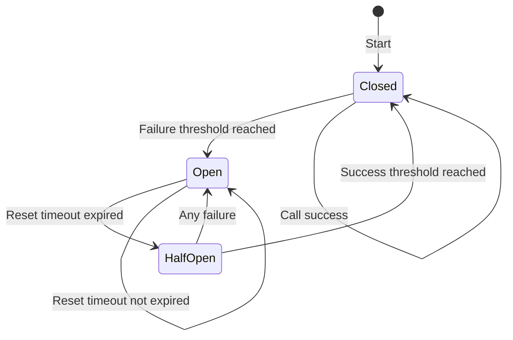

A reliable system can *perform its function*, *tolerate errors,* and *prevent unauthorized access or abuse.* Most failures in distributed systems come from either:

- Hardware errors: Network outages, server failure, etc. These won't be fixed quickly, and are often called non-transient errors.
- Application errors: Bugs, failure to accommodate spikes in traffic, etc. These should resolve quickly and are also known as transient errors.

It should logically follow that beefing up system reliability will have implications for performance and cost in terms of complexity, engineering time, and money. 

:::cautionReliability implies availability,but availability doesn't imply reliability.
Reliability implies availability, but it's more than that. Building for reliability means added security, error-handling, disaster recovery, and countless other contingencies.

Why? Because things will fail. Whether due to network outages, hardware failure, a botched roll-out, or a malicious attack, any system with dependencies must include logic to deal with failures. 
:::

:::cautionReliability in an interview
When implementing reliability techniques in an interview scenario, it's helpful to:
- Refer back to the requirements you've defined upfront. This will help you focus on mitigating the most important / most likely risks.
- Assume failures will happen, and design your system to recover gracefully (in alignment with predefined requirements) from the very beginning.
- Include testing strategies and monitoring techniques to help you benchmark your system in terms of requirements, monitor its health, and make changes as needed. 
:::

## Retries

> TL;DR - To handle **transient failures** by attempting the same operation more than once.

- Under a **simple retry** strategy is for **unusual transient errors**
    - An application detecting a failure will immediately retry. This might work well if the failure detected is unusual and unlikely to repeat, but for common transient failures (e.g. network failures) repeat retries may overload the downstream system once the network issue is resolved. People who use **simple retry** usually implement some type of request limit to prevent overload.
- **Delayed retry** strategy is for **common transient errors**
    - It holds the retry back for a set amount of time allowing the system to recover. 
    - Many engineers implement an **exponential backoff** strategy that systematically decreases the rate of re-transmission in search of an acceptable retry rate.

:::cautionTechniques & considerations
Retry buildup in high-traffic systems can lead to extremely high system load once the error is resolved. This is called the **thundering herd** problem, and it can cause even more problems than the transient error as your resource(s) struggle to cope with the request volume. A simple solution is to introduce **jitter**, or "randomness" to the delay intervals so that client requests don't synchronize.

From a UX perspective, keep in mind that in some cases it's better to fail fast and simply let users know. In this case, implement a low retry limit and alert users that they'll need to try again later.
:::

## Circuit Breakers

> TL;DR - To handle **non-transient failures** or **transient errors with uncertain recovery times** by preventing a flood of requests when a service is struggling and to allow it time to recover to protect user experience from repeated failures.

A circuit breaker is a pattern that detects failures and encloses the failure operation in a circuit. If the errors continue to occur and go beyond a threshold, the circuit breaker 'trips', and further calls to the operation are inhibited. Importantly, after a predefined period, it allows a limited number of test requests to pass through to check if the underlying problem has been fixed.

While a retry pattern assumes that the operation will ultimately succeed, a **circuit breaker** accepts failure and stops the application from repeatedly trying to execute. This saves computing power and helps prevent the cascading failures we discussed above. 

:::cautionTechniques & considerations
There are a few main points to remember when implementing circuit breakers.

- When configuring circuit breakers in system design, it's important to consider factors such as the failure threshold, timeout duration, recovery timeout(depends on the recovery patterns you anticipate), and expected traffic patterns to ensure resilience while avoiding unnecessary interruptions to service.
- You'll need to address exceptions raised when a resource protected with a circuit breaker is unavailable. Common solutions are to temporarily switch to more basic functionality, try a different data source, or to alert the user.
:::

### Use Cases

- Prevents cascading failures when a shared resource goes down.
- Allows for a fast response in cases where performance and response time are critical (by immediately rejecting operations that are likely to timeout or fail).
- Circuit breakers' failure counters combined with event logs contain valuable data that can be used to identify failure-prone resources.

### Diagram

In the Circuit Breaker pattern applied to system design, the states represent the following:

- **Closed**: The request from the application is allowed through to the underlying system. The circuit breaker is in normal operation, monitoring the number of recent failures. If everything is working fine and the failures are below a threshold, it remains in the Closed state.
- **Open**: The failure threshold has been reached, so the circuit breaker "opens" to prevent any further requests to the underlying system, thus giving it time to recover.
- **Half-Open**: After a predefined timeout when the circuit breaker is in an Open state, it enters a Half-Open state. In this state, a limited number of test requests are allowed through. If these requests succeed without failure, the circuit breaker transitions back to Closed. If any of these requests fail, it goes back to the Open state.

## Reliability in micro-services

[Sega pattern](/software-development/system-design/data/data-management/#sega-pattern) is a pattern that establish consistency in distributed applications.
