## History

### API Security Before OAuth

Before OAuth, APIs commonly used HTTP Basic Auth, where applications sent usernames and passwords directly to the API. This method required applications to ask for, store, and use user passwords in API requests, leading to significant security concerns, especially for third-party apps like Twitter clients. Users had to provide their passwords to these apps, without any assurance of how their credentials would be used, increasing the risk of misuse.

To address these issues, various platforms developed their own authentication methods:
- **Flickr**: Implemented FlickrAuth using "frobs" and "tokens".
- **Google**: Developed AuthSub.
- **Facebook**: Used MD5 signed requests.
- **Yahoo!**: Created BBAuth (Browser Based Auth).

However, these varied solutions still required users to share their passwords with third-party applications, posing substantial security risks.
### Evolution of OAuth

- **Collaborative Effort**: Developers from various companies recognized a shared problem and began collaborating on a unified solution.
- **OAuth 1.0**: Published in 2007 and deployed by companies like Twitter, it had limitations:
  - Confusing for developers.
  - Unsafe API key usage in mobile phones.
- **Transition to OAuth 2.0**: As mobile apps became popular, OAuth 1.0's limitations became evident. A new working group under IETF developed OAuth 2.0 to address these issues:
  - Simplified for developers by removing signature requirements and using Bearer tokens.
  - Designed to be secure for mobile apps and single-page apps.
  - Introduced a separation between the authorization server and API server for better scalability.
- **OAuth 2.0 Evolution**: 
  - Finalized in 2012, the OAuth 2.0 spec has continued to evolve.
  - The IETF Working Group continues to enhance OAuth with additional specifications:
    - **OAuth 2.0 for Native Apps**: An extension for native applications.
    - **Device Grant**: Enables OAuth use on smart TVs.
    - **OAuth Security Best Current Practice**: Provides guidelines for building secure OAuth systems.


## How OAuth Improves Application Security


Above is an example of direct password handling in Yelp and LinkedIn before 2007. 

- **Authentication Before OAuth (Direct Password Handling)**: 
  - Applications commonly used username and password prompts within the app.
  - The app exchanges the password for a session cookie, which works for simple web apps with built-in authentication.
  - Issues arise when expanding to mobile apps or multiple apps sharing a user database with single sign-on.
- **Risks of Handling Passwords Directly**
  - **User Concerns**:
    - Trust issues: Users cannot be sure how an app will handle their password.
    - Security risks: Apps could accidentally log or intentionally store passwords.
    - Third-party app risks: Apps asking for passwords (e.g., a photo editor asking for a Dropbox password) can gain full access to accounts, posing significant security threats.
  - **API Concerns**:
    - Indistinguishable requests: API cannot differentiate between genuine apps and potential attackers.
    - Password dumps: Attackers could use leaked passwords to access the API.
    - Scaling MFA: Adding multifactor authentication (MFA) requires updating each app, slowing down development.
- **How OAuth Solves These Issues**
  - **Redirecting to OAuth Server**:
    - **High-Level Mechanism**: Applications redirect users to an OAuth server for login, where users enter their passwords.
    - **Token-Based Access**: After login, the OAuth server redirects users back to the app with tokens, eliminating the need for apps to handle passwords directly.
  - **Benefits of this solution**:
    - **Enhanced Security**: Protects against untrusted third-party apps and ensures first-party apps are more secure and flexible.
    - **MFA Integration**: MFA can be added at the OAuth server without changes to individual apps, streamlining security updates across all applications.

## OAuth & OpenID

> TL;DR - OAuth is about accessing APIs without needing to know the user's identity, while OpenID Connect is about identifying the user by extending OAuth's capabilities. 

- **OAuth**:
  - **Purpose**: Designed for applications to access APIs.
  - **Access Focus**: The application only needs access to the API, not information about the user.
  - **Analogy**: 
    - **Hotel Check-In**: When you check into a hotel, you show your ID and credit card at the front desk (OAuth authorization server), and they give you a key card (access token).
    - **Resource Access**: The key card allows access to rooms (resources) without knowing who you are. The door (resource server) only validates the key card's encoded data, not the user's identity.
- **OpenID Connect**:
  - **Purpose**: Adds user identity information on top of OAuth.
  - **Identity Focus**: Used when an application needs to know who the user is (e.g., showing the user's name or profile photo).
  - **Extension of OAuth**: Uses OAuth's framework but includes user information in the flow.
  - **ID Tokens**: Issues ID tokens, which are statements about the user, in addition to OAuth's access tokens.
  - **Analogy Continuation**: Adds the concept of user information to the existing OAuth process, enabling the OAuth server to communicate user data back to the application.

:::infoAuth0 vs. OAuth: What Is the Difference? 
Auth0 and OAuth (Open Authorization) are both authentication and authorization systems that are used to secure web and mobile applications. However, there are some key differences:

| Auth0                                                                                                                                                                            | 0Auth                                                                                                                      |
|----------------------------------------------------------------------------------------------------------------------------------------------------------------------------------|----------------------------------------------------------------------------------------------------------------------------|
| Auth0  is a cloud-based platform that provides a wide range of authentication and authorization services, such as social login, single sign-on, and multi-factor authentication. | OAuth  is a protocol that defines a set of rules for securely granting access to resources.                                |
| Auth0  provides an API, libraries, and SDKs that can be used to integrate authentication and authorization functionality into your applications.                                 | OAuth  is a protocol that is implemented by applications and services, rather than being provided as a standalone service. |
| Auth0  supports a wide range of authentication and authorization protocols, including OAuth, SAML, and JWT.                                                                      | OAuth  is primarily focused on enabling authorization for APIs.                                                            |                                                         |
:::

## Security Concepts

### Roles in OAuth

In OAuth, there are five main roles. Keep in mind that a platform/product can have multiple roles. For example, GitHub can be both resource server and authorization server.:

1. **Resource Owner**: The user who owns the data and grants access to it.
2. **User Agent**: The device or software (like a browser or mobile app) used by the user.
3. **OAuth Client**: The application requesting access to the user's data on behalf of the user.
4. **Resource Server**: The server hosting the user's data (API).
5. **Authorization Server**: The server responsible for authenticating the user and issuing access tokens to the client.

The authorization server ensures that the client gets access tokens without exposing the user’s credentials. The client then uses these tokens to access resources from the resource server securely.

### Application Types

In OAuth 2.0, client types are defined based on whether the application can use credentials for authentication during the OAuth flow. The two client types are:

- **Confidential Clients**: : Use credentials for secure communication with the authorization server. They are more secure and can skip certain security steps (e.g., consent screens).
    - **Credentials**: Have credentials (e.g., client secret).
    - **Environment**: Typically run on a secure server.
    - **Example**: Web apps using server-side languages like Java, .NET, or PHP.
    - **Security**: Users can't see the credentials as they are stored securely on the server.
    - **Usage**: Can authenticate requests to the authorization server, ensuring only the real application can make requests.
    - **Common Credential**: Client secret is easiest to implement, similar to an API key or password.
- **Public Clients**: Cannot use credentials securely, leading to potential security risks. The authorization server treats these clients differently to mitigate these risks.
    - **Credentials**: Do not have credentials.
    - **Environment**: Run on user-controlled devices.
    - **Example**: Mobile apps, single-page apps (SPA), IoT devices.
    - **Security**: Users can view the source code or extract strings, making it impossible to keep secrets secure.
    - **Risk**: Authorization server cannot be sure if requests are from the real application or a mimic.
    - **Usage**: Must handle authentication without relying on stored credentials.

:::cautionSecurity Best Practices


Never include **a client secret** in public client(e.g. a mobile or single-page application). Use alternative, more secure methods like public/private key pairs if higher security is needed.
:::

### User Consent

OAuth aims to protect user data by ensuring it’s shared only with authorized parties. A crucial part of this process is the consent screen, which asks users for permission and verifies their intent. This step is vital for security, preventing unauthorized access and ensuring that only the user can approve data sharing.

**The outdated password grant flow**, where users directly provide their password to an application, poses significant security risks. Third-party apps could misuse these passwords, and even first-party apps can't guarantee the user's active participation. The authorization server solves these issues by handling password entry and showing the consent screen, thus confirming user approval.

Moreover, **the redirect flow** used in OAuth supports multifactor authentication (MFA), enhancing security. Adding MFA to the authorization server automatically extends this protection to all connected applications without individual modifications, simplifying deployment across multiple apps.

While first-party confidential clients often skip the consent screen due to lower impersonation risks, the redirect step remains crucial for security and MFA integration. For mobile or single-page apps, maintaining the consent screen helps prevent attacks.

### Front Channel vs Back Channel

> TL;DR 
- The front channel: Using the browser’s address bar *to move data between two other pieces of software* is using the front channel.
- The back channel: Any HTTP client that makes a request to an HTTP server is using the back channel, *even if that client is JavaScript code in a browser*

Understanding the front channel and back channel is crucial for secure OAuth flows. The back channel uses secure HTTPS connections for data transfer, ensuring encryption and trust, akin to hand-delivering a package. The front channel uses the browser address bar, introducing security risks similar to using a package delivery service.

OAuth involves users through the front channel for consent, but delivering access tokens this way is insecure. Modern OAuth implementations prefer the back channel, especially with the advent of CORS, which allows secure cross-origin requests in JavaScript apps. The OAuth working group now recommends phasing out the **Implicit flow** to enhance security.

:::infoImplicit Flow
The Implicit Flow is an OAuth 2.0 method where the access token is directly returned to the client via the user's browser, designed for client-side applications that cannot securely store secrets.
:::

:::cautionIs the following JavaScript code making a front-channel or back-channel request?
```javascript
  fetch("https://authorization-server.com/", {
    method: "GET",
    headers: {
      "Content-Type": "application/json"
    }
  })
  .then((response) => {
    return response.json();
  });
```

**Answer**: Back channel, Even though the request method is GET, this is a back-channel request since the JavaScript code handles the HTTP response directly.
:::

:::cautionIs the following JavaScript code making a front-channel or back-channel request?
```javascript
window.location = 'https://authorization-server.com/authorize?client_id=example';
```
Answer: Front Channel,  this code redirects the user's browser to the URL shown.
:::

### Application Identity in public client

Applications, or clients in OAuth terms, have unique identities represented by a **client ID**, which they use throughout the OAuth flow. This ensures users can grant different permissions to different applications.

Mobile and single-page apps can't use **client secrets**, making them vulnerable to token theft. The PKCE (Proof Key for Code Exchange) extension helps by using a unique secret for each request, ensuring only the app that started the flow can complete it.

**Redirect URIs** play a crucial role in verifying application identity, especially for public clients. While HTTPS URLs provide a reliable identity verification, custom URL schemes lack global uniqueness, making them less secure.

:::infoHow to verify the application identity in the API world?


In Google APIs and services, you can restrict which websites are allowed to make API calls by specifying allowed domains. This involves setting up application restrictions in the Google Cloud Console, where you can declare specific domains that are permitted to use the API key.

The concept is quite similar to **redirect uri** in the OAuth flow, isn't it?
:::

## OAuth in different applications

In this section, I'll go through how to use OAuth in various applications. One thing you may notice when registering a client at the OAuth server, the server needs to know the type of application you are building to apply appropriate security policies and configurations. Different application types have unique security requirements and capabilities:

1. **Client Secret**: Server-side apps can securely store a client secret, while mobile and JavaScript apps cannot. Thus, mobile and JavaScript apps are typically not given a client secret.
2. **Token Policies**: The server may issue different types of tokens (e.g., refresh tokens) and set different token lifetimes based on the application type.
3. **CORS Headers**: For JavaScript apps, the server might need to enable CORS headers to facilitate secure cross-origin requests.

### OAuth for Server-Side Applications

- PKCE **Code Verifier**: PKCE mitigates this risk by adding an additional layer of security. It ensures that the authorization code can only be used by the client that requested it.
- **Code Challenge** (Hash): Created by applying a transformation (SHA-256 and Base64URL encoding) to the PKCE code_verifier.
- The `state` parameter: Originally for CSRF protection, can now store app-specific state (e.g., redirect pages like cart or checkout) if the OAuth server supports PKCE. If not, ensure the state is a random value for security.
- **Refresh Tokens**:
   - Used to obtain new access tokens without repeating the authorization code flow.
   - Include the refresh token, client ID, and secret in a back-channel request to the OAuth server.

:::infoWhat is PKCE?
PKCE was originally developed for mobile apps, but now the OAuth working group recommends using PKCE for all types of applications, including server-side apps, even when a client secret is available. This is because PKCE can prevent a subtle attack where authorization codes could be swapped, potentially allowing someone to log into another user's account without detection, posing a significant security risk.
:::



```mermaid
sequenceDiagram
    participant User and User Agent
    participant App
    participant OAuth Server
    participant API Server

    rect rgb(25, 59, 72)
    note right of User and User Agent: Front channel request
    User and User Agent->>App: Clicks Login Button
    App->>App: 1. Generates PKCE Code Verifier<br>2. Hash it to become Code Challenge(Hash)
    App->>User and User Agent: Redirect with Code Challenge(Hash), Client ID, Redirect URL, Scope
    User and User Agent->>OAuth Server: Sends Auth Request via query string. <br>Check ① for the example URL
    OAuth Server->>User and User Agent: Sends temporary one time use Authorization Code
    User and User Agent->>App: Redirect with Authorization Code to get an Access Token
    end
    rect rgb(25, 59, 72)
    note right of App: Back channel request
    App->>OAuth Server: Requests Access Token with Authorization Code, Client ID, Client Secret, PKCE Code Verifier
    OAuth Server->>OAuth Server: 1. Check if anyone used that Authorization Code for the requested Client ID <br>2. Check if the Client Scrent mataches<br>3. Check if I can hash PKCE Code Verifier to get the same the Code Challenge at the first step
    OAuth Server->>App: Sends Access Token (and Refresh Token)<br>Check ② for the example URL
    App->>API Server: Makes API Requests with Access Token
    end
    API Server->>App: Responds to API Requests
    User and User Agent->>App: Uses Application with Access Token
```

- ① Authorization Request URL:
  - https://authorization-server.com/oauth/authorize?response_type=code&client_id=your_client_id&redirect_uri=https%3A%2F%2Fyourapp.com%2Fcallback&scope=openid%20profile%20email&state=random_state_string&code_challenge=your_code_challenge&code_challenge_method=S256
- ② Redirect URL After User Authorization:
  - https://yourapp.com/redirect?code=authorization_code&state=random_state_string
  - - https://yourapp.com/redirect?errorcode=access_denied&state=random_state_string
