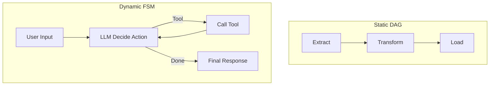

# All Orchestration Systems Are State Machines: A Conceptual Guide for AI Architects

In modern software architecture, especially when designing AI workflows, you'll frequently choose between tools like Airflow, LangGraph, Dagster, or Prefect. While they may appear fundamentally different, they actually share a common conceptual root: **state machines**.

Understanding orchestration through the lens of state machines helps technical leads and architects compare tools not just by features, but by **paradigm**. In this post, we'll break down what this means and why it matters, especially in the age of LLMs and AI agents.

## What Is a State Machine?

A **Finite State Machine (FSM)** is a model where:
- The system is always in one of a finite number of states.
- Transitions between states happen based on inputs or events.
- Each transition can trigger actions or update internal data.

In orchestration terms:
- **States** = steps/nodes/tasks
- **Transitions** = logic that determines the next step
- **Inputs** = outputs of previous steps or external events

## Paradigm Overview: FSMs Behind Orchestration Tools

Let’s break down how common orchestration paradigms relate to state machines:

### 1. **Static DAG (e.g. Airflow, Prefect)**
- Predetermined, acyclic flow.
- Transitions are known ahead of time.
- No dynamic branching or looping.

**FSM Analogy:** A state machine with no loops and a single valid transition from each state.

### 2. **Dynamic FSM / Event-Driven Graph (e.g. LangGraph)**
- Runtime-evaluated transitions.
- Can loop, branch, or reroute based on context.
- Ideal for agent workflows and adaptive systems.

**FSM Analogy:** A state machine where transitions depend on runtime values like LLM outputs, user inputs, or external API results.

### 3. **Modular Toolkits (e.g. LangChain, Haystack)**
- Provide steps (LLM chains, tools), but no orchestration.
- Require external coordination.

**FSM Analogy:** You define the states, but must build your own controller to manage state transitions.

## The Core Insight

> Whether you're building a DAG in Airflow or designing a LangGraph agent loop, you're defining a state machine.

The differences lie in:
- **How flexible the transitions are**
- **How explicitly memory and context are handled**
- **Whether the system is reactive vs. scheduled**

## Visual Comparison

## Why This Matters for LLM Applications

LLM workflows are inherently dynamic:
- They need to loop (agent reasoning).
- They must react to unpredictable outputs.
- They carry memory (context) between steps.

Choosing a system like LangGraph acknowledges this and offers first-class support for FSM behaviours.

Using Airflow for the same use case is like forcing a round peg into a square hole—you’ll spend time re-engineering what LangGraph gives out of the box.

## Summary Table

| Tool              | Paradigm         | FSM Type             | Looping | Dynamic Branching | Contextual State |
|-------------------|------------------|----------------------|---------|-------------------|------------------|
| Airflow           | Static DAG       | Acyclic FSM          | ❌      | ❌                | ❌ (manual)       |
| Prefect           | Static DAG (+)   | Acyclic FSM          | ⚠️      | ⚠️                | ⚠️ (custom logic) |
| LangGraph         | Dynamic FSM      | Reactive FSM         | ✅      | ✅                | ✅                |
| LangChain         | Toolkit          | FSM with manual flow | ⚠️      | ⚠️                | ✅ (optional)     |

## Final Thoughts

Recognising orchestration tools as state machines simplifies how we compare and choose them. Once you understand the **flow of control, state, and transitions**, you can pick the tool that fits your application, not just the trend.

For AI architects building with LLMs, **choose tools that treat reasoning as a first-class citizen**—and that usually means embracing the FSM mindset explicitly.

Stay flexible, stay stateful.

