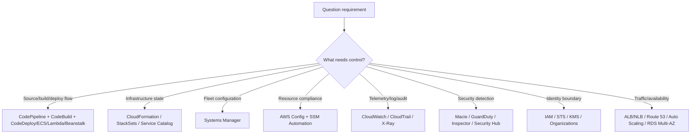

# AWS DevOps Engineer Professional — Extended Trap Atlas

Generated from **14 uploaded markdown files** and **403 parsed questions**.

This notebook is not a generic cheat sheet. It is a question-derived trap atlas: the emphasis is on service boundaries, decision rules, and misleading option wording that repeatedly appeared in the uploaded practice material.

## Final audit overlay — source-of-truth rules

This file has been audited after generation. The mechanical extraction is clean, but the practice papers are **not** the ultimate source of truth. Use this hierarchy when studying and when answering unseen questions:

1. **Current official AWS documentation and the current DOP-C02 exam guide** override everything else.
2. **Question wording and Select count** decide what the exam is asking for.
3. **Service-boundary reasoning** decides the best answer.
4. **Practice-paper explanations** are useful evidence, but can be stale.
5. **Extracted answer labels/checkmarks** are audit signals, not proof.

### Mechanical audit result

| Check | Result |
|---|---:|
| Parsed questions | 403 |
| Select-count mismatches | 0 |
| Correct Answer vs option-checkmark mismatches | 0 |

### Current-AWS caveats to apply while studying

| Caveat area | Rows affected | Source-of-truth adjustment |
|---|---:|---|
| CloudWatch Events to EventBridge | 44 | Translate CloudWatch Events wording to Amazon EventBridge. |
| OpsWorks caution | 11 | Do not default to OpsWorks. Use it only when the question explicitly uses OpsWorks/Chef/Puppet lifecycle hooks; otherwise prefer SSM, CodeDeploy, Beanstalk or CloudFormation. |
| Inspector Classic / assessment-run legacy | 6 | Treat Inspector assessment templates/runs as legacy. Current Inspector continuously scans supported EC2, ECR and Lambda resources; do not design new answers around Classic assessment runs. |
| Amazon ES to OpenSearch | 5 | Translate Amazon ES/Elasticsearch wording to Amazon OpenSearch Service. |
| Launch configuration legacy | 4 | Prefer launch templates for Auto Scaling unless the option set is explicitly historical. |
| ECS image refresh edge case | 1 | For same-tag ECS image updates, the general current rule is force a new deployment or use immutable tags/digests; restart ECS agent only if the scenario points to an agent fault. |
| EKS aws-auth deprecated | 1 | If options include EKS access entries, prefer them. If only old options exist, the core rule is still IAM principal + Kubernetes permission mapping. |
| OAI vs OAC | 1 | Prefer CloudFront OAC over OAI for modern S3-origin private access when available. |
| Macie vs GuardDuty S3 nuance | 1 | Macie = sensitive data discovery/classification. GuardDuty S3 = threat/anomalous access/malware-style detection. |

### Practical implication

The three documents are best used as a **study system**, not three equal authorities:

- The **Core Playbook** is the live-answering rulebook.
- The **Extended Trap Atlas** is the main revision source of truth.
- The **Question-Derived Ledger** is audit evidence and should not be memorised as an answer key.

When a live question resembles a ledger row but uses current AWS wording, solve from the current service boundary first and only then compare with the old pattern.

## Audited caveat index — rows that need current-AWS interpretation

The rows below do **not** mean the extracted answer is automatically wrong. They mean the practice-paper wording uses legacy terminology, legacy services, or an edge-case assumption that should be checked against current AWS behaviour before you reuse the rule in a live exam question.

| Caveat category | Affected rows |
|---|---:|
| CloudWatch Events to EventBridge | 44 |
| OpsWorks caution | 11 |
| Inspector Classic / assessment-run legacy | 6 |
| Amazon ES to OpenSearch | 5 |
| Launch configuration legacy | 4 |
| ECS image refresh edge case | 1 |
| EKS aws-auth deprecated | 1 |
| OAI vs OAC | 1 |
| Macie vs GuardDuty S3 nuance | 1 |

| Severity | Source question | Select | Extracted answer | Cue | Audit note |
|---|---|---:|---|---|---|
| High | neal-1.md Q1 | 2 | A,B | A company runs many different workloads across hundreds of Amazon EC2 instances. The DevOps team requires that all instances have… | Current AWS caveat: Amazon Inspector Classic assessment templates/runs ended support on 20 May 2026; current Inspector is continuous vulnerability scanning for EC2/ECR/Lambda. Treat old assessment-run wording as legacy. Study caution: OpsWorks appears in older-style DevOps questions. Do not generalise it as the default fleet/configuration tool; prefer SSM/CodeDeploy/Beanstalk/CloudFormation unless the question explicitly depends on OpsWorks lifecycle events/Chef/Puppet. |
| High | section-based-configuration-management-and-infrastructure-as-code-devops.md Q3 | 1 | B | A startup is developing an AI-powered traffic monitoring portal that will be hosted in AWS Cloud. The design of the cloud archite… | Current AWS caveat: Amazon Inspector Classic assessment templates/runs ended support on 20 May 2026; current Inspector is continuous vulnerability scanning for EC2/ECR/Lambda. Treat old assessment-run wording as legacy. |
| High | section-based-sdlc-automation-devops.md Q1 | 1 | A | A company has an Amazon ECS cluster with Service Auto Scaling which consists of multiple Amazon EC2 instances that runs a Docker-… | Source-answer caveat: answer A (restart ECS agent) is plausible only under the question’s “occasionally” + EC2/ECS-agent-fault reading. The general current rule for same-tag ECS image refresh is forceNewDeployment or immutable task definition/image digest. |
| High | section-based-security-and-compliance-devops.md Q1 | 2 | D,E | A cloud-based payments company is heavily using Amazon EC2 instances to host their applications in AWS Cloud. They would like to… | Current AWS caveat: Amazon Inspector Classic assessment templates/runs ended support on 20 May 2026; current Inspector is continuous vulnerability scanning for EC2/ECR/Lambda. Treat old assessment-run wording as legacy. Terminology caveat: CloudWatch Events is now Amazon EventBridge. Convert old event-rule wording mentally to EventBridge. |
| High | section-based-security-and-compliance-devops.md Q6 | 1 | B | A company uses a fleet of Linux and Windows servers for its enterprise applications. An automated daily check of each golden AMI… | Current AWS caveat: Amazon Inspector Classic assessment templates/runs ended support on 20 May 2026; current Inspector is continuous vulnerability scanning for EC2/ECR/Lambda. Treat old assessment-run wording as legacy. |
| High | stephane-maarek-1.md Q1 | 1 | B | In a multinational company, various AWS accounts are efficiently managed using AWS Control Tower. The company operates both inter… | Current AWS caveat: EKS aws-auth ConfigMap is deprecated; current source-of-truth answer should use EKS access entries when available, but the underlying rule remains IAM principal + Kubernetes permissions mapping. |
| High | stephane-maarek-1.md Q23 | 1 | B | A company uses AWS Organizations with all features enabled to centrally govern several production and development AWS accounts. A… | Current AWS caveat: Auto Scaling launch configurations have major new-account limitations; prefer launch templates unless the question is explicitly historical or the only valid option is legacy wording. |
| High | stephane-maarek-1.md Q28 | 2 | B,C | A telehealth platform uses Amazon API Gateway and AWS Lambda functions to expose its API. The deployment is automated through an… | Current AWS caveat: Amazon Inspector Classic assessment templates/runs ended support on 20 May 2026; current Inspector is continuous vulnerability scanning for EC2/ECR/Lambda. Treat old assessment-run wording as legacy. |
| High | stephane-maarek-1.md Q39 | 2 | D,E | An application runs on a fleet of Amazon EC2 instances that are configured with an Auto Scaling group (ASG). Both Spot and On-Dem… | Current AWS caveat: Auto Scaling launch configurations have major new-account limitations; prefer launch templates unless the question is explicitly historical or the only valid option is legacy wording. |
| High | stephane-maarek-2.md Q12 | 1 | A | A financial services company is using security-hardened AMI due to strong regulatory compliance requirements. The company must be… | Current AWS caveat: Amazon Inspector Classic assessment templates/runs ended support on 20 May 2026; current Inspector is continuous vulnerability scanning for EC2/ECR/Lambda. Treat old assessment-run wording as legacy. |
| High | stephane-maarek-2.md Q40 | 1 | C | As a DevOps Engineer at a social media company, you have deployed your application in an Auto Scaling group (ASG) using CloudForm… | Current AWS caveat: Auto Scaling launch configurations have major new-account limitations; prefer launch templates unless the question is explicitly historical or the only valid option is legacy wording. |
| High | stephane-maarek-2.md Q55 | 1 | D | The engineering team at a multi-national retail company is deploying its flagship web application onto an Auto Scaling Group (ASG… | Current AWS caveat: Auto Scaling launch configurations have major new-account limitations; prefer launch templates unless the question is explicitly historical or the only valid option is legacy wording. |
| Medium | neal-1.md Q13 | 2 | A,D | A data intelligence and analytics company has implemented a CI/CD pipeline using AWS CodePipeline which takes code from an AWS Co… | Terminology caveat: CloudWatch Events is now Amazon EventBridge. Convert old event-rule wording mentally to EventBridge. |
| Medium | neal-1.md Q5 | 1 | A | A company requires an automated solution that terminates Amazon EC2 instances that have been logged into manually within 24 hours… | Terminology caveat: CloudWatch Events is now Amazon EventBridge. Convert old event-rule wording mentally to EventBridge. |
| Medium | neal-2.md Q17 | 3 | C,E,F | A DevOps engineer builds an artifact locally and then uploads it to an Amazon S3 bucket. The application has a local cache that m… | Terminology caveat: CloudWatch Events is now Amazon EventBridge. Convert old event-rule wording mentally to EventBridge. |
| Medium | neal-2.md Q2 | 1 | D | A company stores sensitive data in Amazon S3 buckets. Each day the development team create new buckets for projects they are work… | Terminology caveat: CloudWatch Events is now Amazon EventBridge. Convert old event-rule wording mentally to EventBridge. |
| Medium | neal-2.md Q7 | 1 | A | A company is using AWS CodeCommit for version control and AWS CodePipeline for orchestration of software deployments. The develop… | Terminology caveat: CloudWatch Events is now Amazon EventBridge. Convert old event-rule wording mentally to EventBridge. |
| Medium | neal-3.md Q6 | 1 | A | The DevOps team at an e-commerce company introduced multiple stages of security to the code release process. As an additional mea… | Terminology caveat: CloudWatch Events is now Amazon EventBridge. Convert old event-rule wording mentally to EventBridge. |
| Medium | neal-4.md Q17 | 3 | C,D,F | A company uses GitHub to store the code for their software development. The company’s DevOps team want to automate the build proc… | Study caution: OpsWorks appears in older-style DevOps questions. Do not generalise it as the default fleet/configuration tool; prefer SSM/CodeDeploy/Beanstalk/CloudFormation unless the question explicitly depends on OpsWorks lifecycle events/Chef/Puppet. |
| Medium | neal-4.md Q20 | 1 | B | A financial services company requires that DevOps engineers should not log directly into Amazon EC2 instances that process highly… | Terminology caveat: CloudWatch Events is now Amazon EventBridge. Convert old event-rule wording mentally to EventBridge. |
| Medium | neal-4.md Q8 | 3 | A,D,F | A company manages both Amazon EC2 instances and on-premises servers running Linux and Windows. A DevOps engineer needs to manage… | Terminology caveat: CloudWatch Events is now Amazon EventBridge. Convert old event-rule wording mentally to EventBridge. |
| Medium | neal-5.md Q16 | 1 | A | A gaming startup company is finishing its migration to AWS and realizes that many DevOps engineers have permissions to delete Ama… | Terminology caveat: CloudWatch Events is now Amazon EventBridge. Convert old event-rule wording mentally to EventBridge. |
| Medium | neal-5.md Q5 | 1 | A | A DevOps manager has been asked to optimize the costs associated with Amazon EBS volumes. There are many unattached EBS volumes w… | Terminology caveat: CloudWatch Events is now Amazon EventBridge. Convert old event-rule wording mentally to EventBridge. |
| Medium | neal-5.md Q8 | 1 | A | The security team at a company requires a solution to identify activities that indicate that Amazon EC2 instances have been compr… | Terminology caveat: CloudWatch Events is now Amazon EventBridge. Convert old event-rule wording mentally to EventBridge. |
| Medium | neal-6.md Q16 | 1 | D | A DevOps team is developing a PHP web application which will be deployed on Amazon EC2 instances. The application has been design… | Study caution: OpsWorks appears in older-style DevOps questions. Do not generalise it as the default fleet/configuration tool; prefer SSM/CodeDeploy/Beanstalk/CloudFormation unless the question explicitly depends on OpsWorks lifecycle events/Chef/Puppet. |
| Medium | neal-6.md Q4 | 1 | D | A DevOps engineer needs to implement an automated deployment process for an application running on AWS. The implementation should… | Study caution: OpsWorks appears in older-style DevOps questions. Do not generalise it as the default fleet/configuration tool; prefer SSM/CodeDeploy/Beanstalk/CloudFormation unless the question explicitly depends on OpsWorks lifecycle events/Chef/Puppet. |
| Medium | neal-6.md Q9 | 1 | B | A DevOps engineer is creating a pipeline in AWS CodePipeline for automation of a testing process. The engineer wants to be notifi… | Terminology caveat: CloudWatch Events is now Amazon EventBridge. Convert old event-rule wording mentally to EventBridge. |
| Medium | section-based-configuration-management-and-infrastructure-as-code-devops.md Q1 | 1 | B | A global cloud-based payment processing system is hosted in AWS which accepts credit card payments as well as cryptocurrencies su… | Current AWS caveat: OAI is legacy for CloudFront-to-S3; current designs usually prefer Origin Access Control (OAC) if available in the option set. |
| Medium | section-based-configuration-management-and-infrastructure-as-code-devops.md Q13 | 1 | C | A DevOps Engineer is designing a service that aggregates clickstream data in real-time. The service should also deliver a report… | Terminology caveat: CloudWatch Events is now Amazon EventBridge. Convert old event-rule wording mentally to EventBridge. |
| Medium | section-based-configuration-management-and-infrastructure-as-code-devops.md Q15 | 2 | A,E | A DevOps Engineer in a leading aerospace engineering company has a hybrid cloud architecture that connects its on-premises data c… | Terminology caveat: CloudWatch Events is now Amazon EventBridge. Convert old event-rule wording mentally to EventBridge. |
| Medium | section-based-configuration-management-and-infrastructure-as-code-devops.md Q17 | 1 | A | A DevOps Engineer has been assigned to develop an automated workflow to ensure that the required patches of all of their Windows… | Terminology caveat: CloudWatch Events is now Amazon EventBridge. Convert old event-rule wording mentally to EventBridge. |
| Medium | section-based-configuration-management-and-infrastructure-as-code-devops.md Q18 | 1 | D | A company that develops smart home devices has a set of serverless APIs that uses several independent AWS Lambda functions that h… | Terminology caveat: CloudWatch Events is now Amazon EventBridge. Convert old event-rule wording mentally to EventBridge. |
| Medium | section-based-incident-and-event-response-devops.md Q9 | 3 | A,B,F | An analytics web portal processes data using an Amazon EMR cluster with an Auto Scaling group of EC2 instances. After three month… | Terminology caveat: CloudWatch Events is now Amazon EventBridge. Convert old event-rule wording mentally to EventBridge. |
| Medium | section-based-monitoring-and-logging-devops.md Q1 | 1 | B | A company developed a web portal for gathering Census data within the city. The household information uploaded on the portal cont… | Current AWS nuance: Macie is the sensitive-data discovery/classification service for S3. GuardDuty S3 Protection is the stronger threat/anomalous-access detector. Choose Macie when the requirement is PII/sensitive data exposure/compliance. |
| Medium | section-based-monitoring-and-logging-devops.md Q14 | 3 | A,C,D | A leading food and beverage company is currently migrating its Docker-based application hosted on-premises to AWS. The applicatio… | Terminology caveat: CloudWatch Events is now Amazon EventBridge. Convert old event-rule wording mentally to EventBridge. |
| Medium | section-based-monitoring-and-logging-devops.md Q18 | 1 | B | A custom web dashboard has been developed for the company that displays all instances running on AWS, including the details of ea… | Terminology caveat: CloudWatch Events is now Amazon EventBridge. Convert old event-rule wording mentally to EventBridge. |
| Medium | section-based-monitoring-and-logging-devops.md Q19 | 1 | B | A web application is hosted on an Auto Scaling group (ASG) of On-Demand EC2 instances. It has a separate Linux EC2 instance used… | Terminology caveat: CloudWatch Events is now Amazon EventBridge. Convert old event-rule wording mentally to EventBridge. |
| Medium | section-based-monitoring-and-logging-devops.md Q21 | 1 | C | A software development company is using GitHub, AWS CodeBuild, AWS CodeDeploy, and AWS CodePipeline for its CI/CD process. To fur… | Terminology caveat: CloudWatch Events is now Amazon EventBridge. Convert old event-rule wording mentally to EventBridge. |
| Medium | section-based-monitoring-and-logging-devops.md Q24 | 1 | A | A Data Analytics team uses a large Hadoop cluster with 100 EC2 instance nodes for gathering trends about user behavior on the com… | Terminology caveat: CloudWatch Events is now Amazon EventBridge. Convert old event-rule wording mentally to EventBridge. |
| Medium | section-based-monitoring-and-logging-devops.md Q8 | 1 | B | You are working as a DevOps engineer for a company that has hundreds of Amazon EC2 instances in their AWS account which runs thei… | Terminology caveat: CloudWatch Events is now Amazon EventBridge. Convert old event-rule wording mentally to EventBridge. |
| Medium | section-based-resilient-cloud-solutions-devops.md Q1 | 1 | B | An international tours and travel company is planning to launch a multi-tier Node.js web portal with a MySQL database to AWS. The… | Terminology caveat: Amazon ES is now Amazon OpenSearch Service. The decision rule is still log/search analytics, but use current service name. |
| Medium | section-based-resilient-cloud-solutions-devops.md Q5 | 1 | D | A PHP web application is uploaded to the AWS Elastic Beanstalk of the company’s development account to automatically handle the d… | Study caution: OpsWorks appears in older-style DevOps questions. Do not generalise it as the default fleet/configuration tool; prefer SSM/CodeDeploy/Beanstalk/CloudFormation unless the question explicitly depends on OpsWorks lifecycle events/Chef/Puppet. |
| Medium | section-based-sdlc-automation-devops.md Q11 | 1 | A | A leading telecommunications company is using CloudFormation templates to deploy enterprise applications to their production, sta… | Study caution: OpsWorks appears in older-style DevOps questions. Do not generalise it as the default fleet/configuration tool; prefer SSM/CodeDeploy/Beanstalk/CloudFormation unless the question explicitly depends on OpsWorks lifecycle events/Chef/Puppet. |
| Medium | section-based-sdlc-automation-devops.md Q14 | 1 | B | A company is running a batch job hosted on AWS Fargate to process large ZIP files. The job is triggered whenever files are upload… | Terminology caveat: CloudWatch Events is now Amazon EventBridge. Convert old event-rule wording mentally to EventBridge. |
| Medium | section-based-sdlc-automation-devops.md Q25 | 1 | C | A startup recently hired a replacement for the DevOps engineer who abruptly resigned from the position. Due to the lack of time f… | Terminology caveat: CloudWatch Events is now Amazon EventBridge. Convert old event-rule wording mentally to EventBridge. |
| Medium | section-based-sdlc-automation-devops.md Q29 | 1 | C | A leading game development company is planning to host its latest video game on AWS. It is expected that there will be millions o… | Terminology caveat: CloudWatch Events is now Amazon EventBridge. Convert old event-rule wording mentally to EventBridge. |
| Medium | section-based-security-and-compliance-devops.md Q10 | 1 | A | A technology consulting company has an Oracle Real Application Clusters (RAC) database on their on-premises network which they wa… | Terminology caveat: CloudWatch Events is now Amazon EventBridge. Convert old event-rule wording mentally to EventBridge. |
| Medium | stephane-maarek-1.md Q36 | 1 | D | A video-sharing application stores its files on an Amazon S3 bucket. During the last year, the user traffic has multiplied by tho… | Terminology caveat: Amazon ES is now Amazon OpenSearch Service. The decision rule is still log/search analytics, but use current service name. |
| Medium | stephane-maarek-1.md Q46 | 1 | C | The flagship application at a company is deployed on Amazon EC2 instances running behind an Application Load Balancer (ALB) withi… | Study caution: OpsWorks appears in older-style DevOps questions. Do not generalise it as the default fleet/configuration tool; prefer SSM/CodeDeploy/Beanstalk/CloudFormation unless the question explicitly depends on OpsWorks lifecycle events/Chef/Puppet. |
| Medium | stephane-maarek-1.md Q70 | 2 | C,D | An application runs on a fleet of Amazon EC2 Windows instances configured with an Auto Scaling group (ASG). When scaling-in takes… | Terminology caveat: CloudWatch Events is now Amazon EventBridge. Convert old event-rule wording mentally to EventBridge. |
| Medium | stephane-maarek-2.md Q15 | 1 | C | A multi-national retail company is operating a multi-account strategy using AWS Organizations. Each account produces logs to Clou… | Terminology caveat: Amazon ES is now Amazon OpenSearch Service. The decision rule is still log/search analytics, but use current service name. |
| Medium | stephane-maarek-2.md Q19 | 1 | D | A 3D modeling company would like to deploy applications on Elastic Beanstalk with support for various programming languages with… | Study caution: OpsWorks appears in older-style DevOps questions. Do not generalise it as the default fleet/configuration tool; prefer SSM/CodeDeploy/Beanstalk/CloudFormation unless the question explicitly depends on OpsWorks lifecycle events/Chef/Puppet. |
| Medium | stephane-maarek-2.md Q27 | 1 | B | Your application is deployed on Elastic Beanstalk and you manage the configuration of the stack using a CloudFormation template.… | Terminology caveat: CloudWatch Events is now Amazon EventBridge. Convert old event-rule wording mentally to EventBridge. |
| Medium | stephane-maarek-2.md Q31 | 1 | B | Your company has adopted CodeCommit and forces developers to create new branches and create pull requests before merging the code… | Terminology caveat: CloudWatch Events is now Amazon EventBridge. Convert old event-rule wording mentally to EventBridge. |
| Medium | stephane-maarek-2.md Q32 | 1 | D | A social media company is running its flagship application via an Auto-Scaling group (ASG) which has 15 EC2 instances spanning ac… | Terminology caveat: CloudWatch Events is now Amazon EventBridge. Convert old event-rule wording mentally to EventBridge. |
| Medium | stephane-maarek-2.md Q34 | 1 | B | An e-commerce company is managing its entire application stack and infrastructure using AWS OpsWorks Stacks. The DevOps team at t… | Terminology caveat: CloudWatch Events is now Amazon EventBridge. Convert old event-rule wording mentally to EventBridge. Study caution: OpsWorks appears in older-style DevOps questions. Do not generalise it as the default fleet/configuration tool; prefer SSM/CodeDeploy/Beanstalk/CloudFormation unless the question explicitly depends on OpsWorks lifecycle events/Chef/Puppet. |
| Medium | stephane-maarek-2.md Q35 | 1 | D | A cyber-security company has had a dubious distinction of their own AWS account credentials being put in public GitHub repositori… | Terminology caveat: CloudWatch Events is now Amazon EventBridge. Convert old event-rule wording mentally to EventBridge. |
| Medium | stephane-maarek-2.md Q42 | 1 | B | As a DevOps Engineer at a social media company, you have implemented a CICD pipeline that takes code from a CodeCommit repository… | Terminology caveat: CloudWatch Events is now Amazon EventBridge. Convert old event-rule wording mentally to EventBridge. |
| Medium | stephane-maarek-2.md Q43 | 3 | B,C,F | A social media company has multiple EC2 instances that are behind an Auto Scaling group (ASG) and you would like to retrieve all… | Terminology caveat: CloudWatch Events is now Amazon EventBridge. Convert old event-rule wording mentally to EventBridge. |
| Medium | stephane-maarek-2.md Q45 | 1 | B | The DevOps team at an e-commerce company is working with the in-house security team to improve the security workflow of the code… | Terminology caveat: CloudWatch Events is now Amazon EventBridge. Convert old event-rule wording mentally to EventBridge. |
| Medium | stephane-maarek-2.md Q48 | 1 | D | A gaming company would like to be able to receive near real-time notifications when the API call `DeleteTable` is invoked in Dyna… | Terminology caveat: CloudWatch Events is now Amazon EventBridge. Convert old event-rule wording mentally to EventBridge. |
| Medium | stephane-maarek-2.md Q50 | 1 | C | An analytics company is capturing metrics for its AWS services and applications using CloudWatch metrics. It needs to be able to… | Terminology caveat: Amazon ES is now Amazon OpenSearch Service. The decision rule is still log/search analytics, but use current service name. |
| Medium | stephane-maarek-2.md Q52 | 1 | A | As a DevOps Engineer at an IT company, you are looking to create a daily EBS backup workflow. That workflow must take an EBS volu… | Terminology caveat: CloudWatch Events is now Amazon EventBridge. Convert old event-rule wording mentally to EventBridge. |
| Medium | stephane-maarek-2.md Q53 | 2 | A,B | The compliance department at a Wall Street trading firm has hired you as an AWS Certified DevOps Engineer Professional to help wi… | Terminology caveat: CloudWatch Events is now Amazon EventBridge. Convert old event-rule wording mentally to EventBridge. |
| Medium | stephane-maarek-2.md Q57 | 1 | A | A health-care services company has strong regulatory requirements and it has come to light recently that some of the EBS volumes… | Terminology caveat: CloudWatch Events is now Amazon EventBridge. Convert old event-rule wording mentally to EventBridge. |
| Medium | stephane-maarek-2.md Q6 | 1 | A | A Big Data analytics company is operating a distributed Cassandra cluster on EC2. Each instance in the cluster must have a list o… | Study caution: OpsWorks appears in older-style DevOps questions. Do not generalise it as the default fleet/configuration tool; prefer SSM/CodeDeploy/Beanstalk/CloudFormation unless the question explicitly depends on OpsWorks lifecycle events/Chef/Puppet. |
| Medium | stephane-maarek-2.md Q65 | 1 | A | A global financial services company manages over 100 accounts using AWS Organizations and it has recently come to light that seve… | Terminology caveat: CloudWatch Events is now Amazon EventBridge. Convert old event-rule wording mentally to EventBridge. |
| Medium | stephane-maarek-2.md Q67 | 1 | C | An e-commerce company would like to automate the patching of their hybrid fleet and distribute some patches through their interna… | Study caution: OpsWorks appears in older-style DevOps questions. Do not generalise it as the default fleet/configuration tool; prefer SSM/CodeDeploy/Beanstalk/CloudFormation unless the question explicitly depends on OpsWorks lifecycle events/Chef/Puppet. |
| Medium | stephane-maarek-2.md Q69 | 1 | C | A data analytics company would like to create an automated solution to be alerted in case of EC2 instances being under-utilized f… | Terminology caveat: CloudWatch Events is now Amazon EventBridge. Convert old event-rule wording mentally to EventBridge. |
| Medium | stephane-maarek-2.md Q72 | 1 | B | An ed-tech company has created a paid-per-use API using API Gateway. This API is available at `http://edtech.com/api/v1`. The web… | Terminology caveat: Amazon ES is now Amazon OpenSearch Service. The decision rule is still log/search analytics, but use current service name. |
| Medium | stephane-maarek-2.md Q9 | 1 | B | A financial planning company runs a tax optimization application that allows people to enter their personal financial information… | Terminology caveat: CloudWatch Events is now Amazon EventBridge. Convert old event-rule wording mentally to EventBridge. |

## Inventory and parse quality

| Source file | Declared questions | Parsed questions | Parse status |
|---|---:|---:|---|
| section-based-incident-and-event-response-devops.md | 10 | 10 | OK |
| section-based-sdlc-automation-devops.md | 30 | 30 | OK |
| section-based-security-and-compliance-devops.md | 12 | 12 | OK |
| section-based-configuration-management-and-infrastructure-as-code-devops.md | 30 | 30 | OK |
| section-based-monitoring-and-logging-devops.md | 26 | 26 | OK |
| section-based-resilient-cloud-solutions-devops.md | 15 | 15 | OK |
| neal-1.md | 25 | 25 | OK |
| neal-2.md | 25 | 25 | OK |
| neal-3.md | 20 | 20 | OK |
| neal-4.md | 20 | 20 | OK |
| neal-5.md | 20 | 20 | OK |
| neal-6.md | 20 | 20 | OK |
| stephane-maarek-1.md | 75 | 75 | OK |
| stephane-maarek-2.md | 75 | 75 | OK |

**Total parsed questions:** 403  
**Duplicate question texts detected:** 0  
**Answer-count mismatches against Select count:** 0  
**Rows with legacy/current-terminology verification notes:** 54

## Domain distribution inferred from the parsed files

| Domain | Parsed questions |
|---|---:|
| SDLC Automation | 127 |
| Resilient Cloud Solutions | 102 |
| Configuration Management and IaC | 74 |
| Monitoring and Logging | 44 |
| Security and Compliance | 41 |
| Incident and Event Response | 15 |

## Most frequent service areas in the parsed material

| Service area | Question mentions |
|---|---:|
| Amazon EC2 | 180 |
| AWS Lambda | 118 |
| Amazon S3 | 95 |
| Auto Scaling | 86 |
| Amazon CloudWatch | 82 |
| Amazon EventBridge | 70 |
| AWS CodePipeline | 63 |
| Elastic Load Balancing | 62 |
| AWS IAM | 54 |
| AWS Systems Manager | 50 |
| AWS CloudFormation | 47 |
| AWS CodeDeploy | 46 |
| Amazon SNS | 41 |
| AWS CodeBuild | 40 |
| Amazon RDS | 39 |
| Amazon DynamoDB | 29 |
| Amazon Route 53 | 28 |
| AWS Organizations | 28 |
| AWS Config | 28 |
| Amazon ECS | 26 |
| Elastic Beanstalk | 22 |
| AWS CloudTrail | 21 |
| AWS CodeCommit | 21 |
| Amazon API Gateway | 20 |
| Amazon CloudFront | 18 |
| Amazon Kinesis | 16 |
| AWS CloudWatch Synthetics | 10 |
| AWS WAF | 8 |
| AWS Secrets Manager | 8 |
| Amazon ECR | 8 |
| Amazon Inspector | 7 |
| AWS KMS | 7 |
| AWS Trusted Advisor | 6 |
| AWS Step Functions | 6 |
| Amazon GuardDuty | 5 |

## How to study this atlas

Use each section as a decision tree. The exam rarely asks “what is service X?” directly. It usually describes an operational constraint and offers several adjacent services. Your job is to identify which service owns the control point.

A good mental model is:

## Domain 1 — SDLC Automation

### Core service boundaries

| Need | Choose | Do not confuse with |
|---|---|---|
| Orchestrate release stages | **CodePipeline** | CodeBuild or CodeDeploy alone |
| Compile, test, package, run CLI commands | **CodeBuild** | CodePipeline stage orchestration |
| Deploy to EC2/on-prem with lifecycle hooks | **CodeDeploy EC2/On-Premises** | CloudFormation stack updates |
| Shift traffic for ECS/Lambda deployments | **CodeDeploy / ECS / Lambda deployment strategy depending wording** | Route 53 failover |
| Host and deploy simple web apps with low ops | **Elastic Beanstalk** | Hand-built ASG/ALB unless more control is required |
| Publish/pull container images | **ECR + ECS task definitions/services** | Assuming tasks automatically refresh changed tags |
| Store source | **CodeCommit** | Build or deploy engine |

### Decision rules

1. **Pipeline questions are about orchestration, not execution.** CodePipeline connects actions. CodeBuild builds and tests. CodeDeploy deploys. CloudFormation provisions. When an option asks CodePipeline to do detailed build logic without CodeBuild, be suspicious.
2. **CodeBuild permissions belong on the CodeBuild service role.** If a build cannot read S3, pull from ECR, write logs, or assume a deployment role, the clean fix is a least-privilege service role and, where encrypted artefacts are involved, KMS key policy access.
3. **Cross-account pipelines have two boundaries.** The source/deployment service must be allowed to assume the target role, and encrypted artefact buckets need KMS permission. A correct IAM policy without KMS is incomplete.
4. **CloudFormation does not notice overwritten Lambda artefacts.** If a template still points to the same S3 bucket/key and no object version is supplied, the stack may not update the function code. Change the key, bucket, or `S3ObjectVersion`.
5. **ECS image tag changes require a deployment event.** Running tasks do not magically update. For same-tag releases, force a new deployment or create a new task definition revision depending the option set.
6. **Elastic Beanstalk blue/green means separate environments + CNAME swap.** Traffic splitting is canary-style; rolling/immutable updates are different patterns.
7. **CodeDeploy hooks are lifecycle-specific.** If the question mentions validation before/after traffic, scripts, rollback, or deployment lifecycle events, hooks and deployment groups are likely relevant.

### Common traps

- **“Use latest tag” alone** is not a full deployment strategy. It may still require force-new-deployment and creates traceability risk compared with immutable tags/digests.
- **“Enable SAM”** is not a quick fix for CloudFormation not detecting Lambda S3 artefact changes.
- **Route 53 failover** is not the best answer for blue/green deployment rollback when CodeDeploy or Beanstalk directly controls the release.
- **Manual approvals** in CodePipeline are for human gates, not automated test execution.
- **Lambda deployment** uses versions/aliases/traffic shifting. Do not modify `$LATEST` in production when a safe alias-based deployment is required.
- **EKS cross-account deployment** needs both STS role assumption and Kubernetes RBAC mapping, historically via `aws-auth` ConfigMap or current EKS access-entry mechanisms depending wording.

### Memory rules

- **Pipeline wires; Build builds; Deploy deploys; CloudFormation provisions.**
- **Artefact encryption = IAM + KMS.**
- **Same S3 key is invisible to CloudFormation unless version/key changes.**
- **Beanstalk blue/green = two environments, CNAME swap.**

## Domain 2 — Configuration Management and Infrastructure as Code

### CloudFormation boundaries

CloudFormation owns desired infrastructure state. It is strongest when the question asks for repeatable provisioning, stack updates, drift detection, change preview, multi-account/multi-region deployment, or deletion protection.

| Requirement | Prefer | Trap |
|---|---|---|
| Preview stack impact before update | Change set | Direct update without visibility |
| Detect manual resource changes | Drift detection | CloudTrail alone only tells who called APIs |
| Protect critical resources during stack update | Stack policy / termination protection / DeletionPolicy depending wording | IAM alone if the risk is stack operation behaviour |
| Roll out baseline to many accounts/regions | StackSets, often with Organizations service-managed permissions | Manual per-account stack creation |
| Reuse large templates | Nested stacks/modules | Copy-paste templates with drift risk |
| Store dynamic values/secrets | Parameter Store / Secrets Manager dynamic references | Plaintext template parameters or outputs |

### Systems Manager boundaries

Systems Manager owns operational configuration of managed nodes and AWS resources. It appears in questions about patching, command execution, inventory, private instance access, automation runbooks, and parameter storage.

- **Run Command** executes commands across managed instances without SSH.
- **State Manager** enforces desired instance state over time.
- **Patch Manager** applies patch baselines and can run through maintenance windows.
- **Session Manager** provides interactive access without inbound SSH/RDP. Private access uses interface VPC endpoints for Systems Manager/SSM messages/EC2 messages.
- **Automation** runs multi-step remediation or operational workflows.
- **Parameter Store SecureString** is good for encrypted configuration values; **Secrets Manager** is stronger when secret rotation is required.

### AWS Config boundaries

AWS Config records resource configuration and evaluates compliance against rules. It is usually the correct answer when the scenario says “all existing and future resources must comply”, “automatically remediate non-compliant resources”, or “audit configuration history”. Config remediation uses Systems Manager Automation documents.

Important distinction:

- **Config**: what is the resource configuration and is it compliant?
- **CloudTrail**: who called what API and when?
- **CloudWatch**: what is happening in metrics/logs now?
- **Systems Manager**: execute remediation/commands/patches.

### Common traps

- **Do not use CloudFormation to patch existing instances by redeploying AMIs.** AMIs initialise new instances; they do not patch existing instance state.
- **Do not use Inspector to install or manage agents.** Inspector assesses; Systems Manager manages.
- **Do not build scheduled Lambda compliance scanners when Config has managed rules/remediation.** Custom Lambda is acceptable only when the managed rule/action does not exist or the question explicitly requires custom logic.
- **Do not store secrets in CloudFormation outputs.** Outputs can be exposed. Use dynamic references and avoid echoing secrets.
- **StackSets are for stacks across accounts/regions.** They are not the same as nested stacks.

### Memory rules

- **Config detects; SSM Automation remediates.**
- **CloudFormation declares; SSM configures runtime state.**
- **StackSets scale CloudFormation across accounts/regions.**
- **Secrets rotation → Secrets Manager; secure config value → Parameter Store can be enough.**

## Domain 3 — Resilient Cloud Solutions

### High availability and deployment resilience

The exam uses resilience questions to test whether you choose the right failure boundary.

| Failure or change boundary | Best-fit pattern | Common wrong turn |
|---|---|---|
| Single EC2 instance failure | ASG across AZs behind ALB/NLB | Manually reboot or run Lambda polling |
| Application version failure | CodeDeploy/Beanstalk blue-green/rollback | Route 53 failover unless regional failover is meant |
| Database AZ failure | RDS/Aurora Multi-AZ | Read replica as primary HA mechanism |
| Regional outage | Route 53/Global Accelerator + multi-region architecture + data replication | Multi-AZ only |
| Instance launch slowness | Golden AMI + minimal user data, lifecycle hooks/warm pools where relevant | Install everything at boot |
| Stateful file access | EFS/FSx according protocol/performance | Instance store/EBS on single instance |

### RDS and data-layer traps

- **Multi-AZ is HA.** It provides standby/failover semantics for relational databases.
- **Read replicas are read scaling and DR candidates, not synchronous HA.** Promotion can take time and is not a direct replacement for Multi-AZ.
- **DynamoDB is not a drop-in MySQL migration target** unless the scenario explicitly accepts NoSQL data modelling changes.
- **Backups vs replication.** AWS Backup centralises backup policy; cross-region replicas/global databases address regional recovery patterns.
- **Elastic Beanstalk RDS lifecycle.** Production RDS should normally be decoupled from the Beanstalk environment so deleting/replacing the environment does not delete the database.

### Auto Scaling and load-balancing traps

- **Health checks matter.** EC2 status checks are not the same as ALB target health checks. If the app must be reachable, use the load balancer/application health boundary.
- **Lifecycle hooks buy time.** Use them when instances need pre-traffic warm-up, draining, registration, or custom actions during scale in/out.
- **Warm-up and cooldown affect scaling behaviour.** Do not choose generic scheduled Lambda polling when target tracking/step/scheduled scaling policies directly model the load.
- **Placement groups are narrow.** Use cluster placement for low-latency HPC patterns, not ordinary HA.

### Memory rules

- **Multi-AZ survives AZ failure; read replica scales reads.**
- **ASG replaces capacity; CodeDeploy replaces versions.**
- **DNS failover is regional/coarse, not app deployment control.**
- **Bake static boot work into AMIs; leave dynamic config to user data/SSM.**

## Domain 4 — Monitoring and Logging

### CloudWatch boundaries

CloudWatch is the operational telemetry service: metrics, alarms, dashboards, logs, log metric filters, subscription filters, Logs Insights, Synthetics, and container/application insights.

| Requirement | Choose | Avoid |
|---|---|---|
| Alert when log line matches `CRITICAL` | Logs metric filter + metric alarm + SNS | Synthetics, Inspector, Firewall Manager |
| Search logs interactively | CloudWatch Logs Insights | Exporting to OpenSearch unless long-term/full-text analytics is required |
| Stream logs to processing target | Subscription filter to Lambda/Kinesis/OpenSearch | Metric filter if full event payload is needed |
| Endpoint/API synthetic checks | CloudWatch Synthetics canary | Metric filter on application logs |
| Distributed request tracing | X-Ray | CloudTrail or VPC Flow Logs |
| Combine alarm conditions | Composite alarms | Duplicated SNS fan-out logic |

### CloudTrail boundaries

CloudTrail is the audit/event provenance service, not a metric/log-query service. It answers “who did what API call, from where, and when?”

Important distinctions:

- **Management events** track control-plane operations and are generally the core API audit trail.
- **Data events** track high-volume data-plane operations such as S3 object-level `GetObject`, `PutObject`, and `DeleteObject`; they must be enabled explicitly and may cost more.
- **Log-file integrity validation** gives tamper evidence for CloudTrail logs using digest files and signatures.
- **CloudTrail Lake/Event data stores** may appear for queryable audit data, but many older questions still expect trails to S3/CloudWatch Logs.

### EventBridge boundaries

EventBridge reacts to events and schedules. It is the right primitive when the question says “when this AWS event happens, trigger remediation/notification/workflow”. Legacy practice questions may say CloudWatch Events; mentally translate most of those to EventBridge.

### Common traps

- **S3 server access logging is not the same as CloudTrail data events.** Server access logs can help access analysis but CloudTrail is the API audit trail.
- **Security Hub does not generate telemetry.** It aggregates findings from services such as GuardDuty, Inspector, and Macie.
- **CloudWatch Logs does not fetch logs by itself from instances.** You need an agent or service integration to push/stream logs.
- **Metric filters create metrics, not full-text search indexes.** Use Logs Insights/OpenSearch/subscription filters according to the analysis need.
- **AWS Health / Personal Health Dashboard** is for AWS service/account health events, not arbitrary EC2 state changes.

### Memory rules

- **CloudWatch = metrics/logs/alarms.**
- **CloudTrail = API audit.**
- **EventBridge = event routing.**
- **X-Ray = trace a request path.**
- **Metric filter = log text becomes metric.**

## Domain 5 — Incident and Event Response

Incident questions often combine detection, notification, and automated action. Break them into three parts:

1. **Signal source** — CloudWatch alarm, CloudTrail/EventBridge event, Config non-compliance, GuardDuty finding, AWS Health event.
2. **Routing** — EventBridge rule, SNS, SQS, Step Functions, Systems Manager OpsCenter/Incident Manager.
3. **Action** — SSM Automation, Lambda, Auto Scaling action, CodeDeploy rollback, Config remediation.

### Decision patterns

| Scenario cue | Pattern |
|---|---|
| Firewall/app logs already in CloudWatch Logs | Metric filter → alarm → SNS/response workflow |
| Resource drift/non-compliance appears | Config rule → remediation action / SSM Automation |
| GuardDuty/Macie/Inspector finding needs routing | EventBridge/Security Hub → SNS/Lambda/SSM/incident workflow |
| Deployment alarm trips | CodeDeploy/CloudWatch alarm integration for rollback |
| EC2 instance state change | EventBridge EC2 state-change event → SNS/Lambda/SSM |
| Scaling termination needs cleanup | Auto Scaling lifecycle hook → EventBridge/SNS/SQS/Lambda |
| AWS service health issue | AWS Health events → EventBridge/SNS/incident process |

### Common traps

- **Do not poll when events exist.** EventBridge is usually cleaner than scheduled Lambda for AWS service events.
- **Do not remediate compliance with notification only.** If the requirement says automatically fix, the action must change the resource.
- **Do not use Synthetics for log events.** Canaries check endpoints/workflows; they do not parse arbitrary firewall logs.
- **Do not treat every alert as an incident.** Some questions only require notification; others require automated rollback/remediation.
- **Do not bypass least privilege in panic.** Incident automation still needs scoped IAM/KMS permissions.

### Memory rules

- **Detect → route → act.**
- **EventBridge for events; CloudWatch alarms for thresholds; Config for compliance.**
- **SSM Automation is the managed action engine.**

## Domain 6 — Security and Compliance

### IAM, STS, and cross-account access

Cross-account DevOps questions are high-risk because one missing permission boundary invalidates the answer.

Checklist:

1. The **target account role** trusts the source account/service principal.
2. The **source role/service role** has permission to call `sts:AssumeRole`.
3. The **target role** has permissions for the target AWS service.
4. Any **KMS key policy/grant** allows the relevant principal.
5. Any **service-specific mapping** is configured, such as EKS cluster access/RBAC mapping.
6. `iam:PassRole` is present when a service must pass a role to another service.

### KMS and encryption traps

- IAM access to S3/CodePipeline/CodeBuild is insufficient when artefacts are encrypted with a customer-managed KMS key.
- Key policy and grants can be the real blocker in cross-account questions.
- Secrets in Parameter Store/Secrets Manager use KMS, so the caller needs both service permission and decrypt permission.
- CloudWatch Logs, CloudTrail, S3, EBS, RDS, and CodePipeline artefacts may each have separate encryption controls.

### Security service boundaries

| Requirement | Choose | Why |
|---|---|---|
| Discover/classify PII or sensitive data in S3 | Macie | Content-aware sensitive data discovery |
| Detect malicious/anomalous AWS activity | GuardDuty | Threat detection from logs/data sources/threat intelligence |
| Vulnerability/exposure assessment | Inspector | CVE/exposure scanning for supported workloads/images/functions |
| Central security posture and findings | Security Hub | Aggregates and normalises findings; not the primary detector |
| Web L7 filtering, geo/IP/rate rules | AWS WAF | Web ACL rules at CloudFront/ALB/API Gateway/AppSync/Cognito where supported |
| DDoS protection and response support | AWS Shield Advanced | DDoS-specific protections/cost protection/support |
| Organisation-wide preventive guardrails | SCPs / Control Tower | Preventive policy boundaries across accounts/OUs |
| Resource compliance detection | AWS Config | Configuration evaluation and remediation |

### S3 security patterns

- **Block public access** is the baseline for preventing broad public exposure.
- **Bucket policies** express resource-level controls, including organisation/account/VPC endpoint constraints.
- **Default encryption** protects new objects at rest; bucket policies can enforce encrypted uploads.
- **Versioning + MFA Delete/Object Lock** address deletion/tamper-resistance scenarios depending wording.
- **Macie** discovers sensitive data; **CloudTrail data events** audit object API activity; **GuardDuty S3 Protection** detects suspicious S3 activity.

### WAF and edge security traps

- ALB listener rules route based on host/path/header/query/etc.; they do not provide WAF geo match or IP set semantics.
- NACLs are stateless network-layer controls and cannot elegantly express country-based web filtering.
- CloudFront signed URLs/cookies control private content access but do not encrypt sensitive form fields.
- CloudFront field-level encryption protects selected fields in HTTPS POST requests through the application stack.
- OAI appears in older questions for private S3 origins; current designs often prefer OAC, so verify wording.

### Memory rules

- **Macie sees data; GuardDuty sees threats; Inspector sees vulnerabilities; Security Hub sees findings.**
- **IAM + KMS, not IAM alone.**
- **SCP prevents; Config detects/remediates.**
- **WAF is L7; NACL/security groups are network-level.**

## Cross-domain “almost correct but not best” patterns

| Distractor | Why it is tempting | Why it usually loses |
|---|---|---|
| Scheduled Lambda scanner | Flexible and familiar | Higher ops than Config/EventBridge/managed remediation |
| Route 53 failover for deployments | Can redirect traffic | Coarse DNS control; not app release lifecycle |
| Security Hub as detector | Security-branded service | Aggregates findings from detectors; does not replace them |
| Read replica for HA | Looks like another copy | Asynchronous/read scaling; Multi-AZ is HA failover |
| Inspector for patching | Security assessment service | SSM Patch Manager patches; Inspector assesses |
| S3 access logs for audit | Logs object access | CloudTrail data events are the API audit trail |
| CloudFormation for runtime commands | Infrastructure as code | SSM/CodeDeploy handles runtime configuration/deployment hooks |
| ALB/NACL for country filtering | Network/web entry point | WAF owns geo/IP match rules |
| Access keys on EC2 | Makes API calls work | Instance profiles/roles are safer and expected |
| Custom scripts for fleet management | Technically possible | SSM gives lower overhead and auditability |

## High-risk current-behaviour verification list

Use official AWS docs when answering questions involving these areas:

- ECS deployment behaviour, same-tag image updates, deployment circuit breaker, and native vs CodeDeploy blue/green modes.
- CloudFormation Lambda code artefacts and StackSets service-managed permissions.
- Systems Manager VPC endpoints and Session Manager prerequisites.
- AWS Config managed rules/remediation documents.
- CloudTrail data events, event history, digest validation, and CloudTrail Lake wording.
- WAF supported resources and OAI vs OAC for CloudFront/S3 origins.
- EKS access management, especially older `aws-auth` wording vs newer access entries.
- Inspector coverage, especially EC2/container image/Lambda vulnerability scanning.
- EventBridge vs legacy CloudWatch Events naming.
- Amazon ES vs Amazon OpenSearch Service naming.

## Official verification anchors

- [Exam guide](https://docs.aws.amazon.com/aws-certification/latest/devops-engineer-professional-02/devops-engineer-professional-02.html)
- [CodeDeploy deployments](https://docs.aws.amazon.com/codedeploy/latest/userguide/deployments.html)
- [ECS blue/green deployments](https://docs.aws.amazon.com/AmazonECS/latest/developerguide/deployment-type-bluegreen.html)
- [ECS force new deployment](https://docs.aws.amazon.com/cli/latest/reference/ecs/update-service.html)
- [CloudFormation Lambda code property](https://docs.aws.amazon.com/AWSCloudFormation/latest/TemplateReference/aws-properties-lambda-function-code.html)
- [Config remediation](https://docs.aws.amazon.com/config/latest/developerguide/remediation.html)
- [Systems Manager VPC endpoints](https://docs.aws.amazon.com/systems-manager/latest/userguide/setup-create-vpc.html)
- [Session Manager](https://docs.aws.amazon.com/systems-manager/latest/userguide/session-manager.html)
- [CloudWatch metric filters](https://docs.aws.amazon.com/AmazonCloudWatch/latest/logs/MonitoringLogData.html)
- [CloudTrail log file validation](https://docs.aws.amazon.com/awscloudtrail/latest/userguide/cloudtrail-log-file-validation-intro.html)
- [S3 CloudTrail data events](https://docs.aws.amazon.com/AmazonS3/latest/userguide/cloudtrail-logging-s3-info.html)
- [Lambda provisioned concurrency](https://docs.aws.amazon.com/lambda/latest/dg/provisioned-concurrency.html)
- [Macie overview](https://docs.aws.amazon.com/macie/latest/user/what-is-macie.html)
- [GuardDuty overview](https://docs.aws.amazon.com/guardduty/latest/ug/what-is-guardduty.html)
- [WAF geo match](https://docs.aws.amazon.com/waf/latest/developerguide/waf-rule-statement-type-geo-match.html)
- [WAF IP set](https://docs.aws.amazon.com/waf/latest/developerguide/waf-rule-statement-type-ipset-match.html)
- [CloudFormation StackSets](https://docs.aws.amazon.com/AWSCloudFormation/latest/UserGuide/what-is-cfnstacksets.html)
- [Elastic Beanstalk CNAME swap](https://docs.aws.amazon.com/elasticbeanstalk/latest/dg/using-features.CNAMESwap.html)